# PLM DB 설계: ERD 및 데이터 스키마 (Supabase Pro 단일)

- 작성일: 2026-09-16 (v2: Firebase 제거, 모션 인식도 Supabase Postgres)
- 근거: `supabase/migrations/*.sql`, `supabase/README.md`(posture 컬럼안), `backend/app/schemas/{profile,movement}.py`, `backend/app/services/movement/{events,calibration,session_manager}.py`, `frontend/lib/features/*/models/*.dart`, `docs/requirements/04_1_기능요구사항명세서.md`, `04_2_비기능요구사항명세서.md`, `04_3_개발순서.md`, `docs/서비스흐름도/*.mmd`

---

## 1. 저장소 분담

| 영역 | 저장소 | 비고 |
|---|---|---|
| 인증 | Supabase Auth | `core/security.py` 토큰 검증 그대로 |
| AI 추천 (프로필·컨디션·루틴·피드백·리포트) | Postgres `public` | 5개 도메인 그룹 |
| 챗봇 | Postgres `public.chat_messages` | 당일 식사 재조정 대화 |
| 모션 인식 | Postgres `public.motion_*`, `posture_*` | `supabase/README.md` 컬럼안 그대로 + 세션 테이블 |
| 저장 안 함 | 프레임·33 landmark(`PostureFrameState`), 원본 영상 | `schemas/movement.py` 결정, NFR-011 |

접근 원칙(기존 `pregnancy_profiles` 컨벤션): **FastAPI(service role)만 접근.** 모든 테이블 RLS 켜고 정책 없음. 클라이언트 anon 키 직접 접근 차단.

---

## 2. ERD

```mermaid
erDiagram
    auth_users ||--o| profiles : "user_id"
    auth_users ||--o| pregnancy_profiles : "user_id"
    auth_users ||--o{ partner_invitations : "wife_user_id"
    auth_users ||--o| partner_links : "wife_user_id"
    auth_users ||--o| partner_links : "husband_user_id"
    auth_users ||--o{ daily_conditions : "user_id"
    daily_conditions ||--o| daily_routines : "(user_id, date)"
    daily_routines ||--o{ routine_items : "routine_id"
    routine_items ||--o{ recommendation_feedback : "routine_item_id"
    routine_items ||--o{ chat_messages : "routine_item_id"
    auth_users ||--o{ household_requests : "wife_user_id"
    household_requests ||--|{ household_request_items : "request_id"
    routine_items ||--o| household_request_items : "routine_item_id"
    auth_users ||--o{ daily_reports : "user_id"
    auth_users ||--o{ notifications : "recipient_user_id"
    auth_users ||--o| motion_consents : "user_id"
    auth_users ||--o{ posture_calibrations : "user_id"
    auth_users ||--o{ motion_sessions : "user_id"
    posture_calibrations ||--o{ motion_sessions : "calibration_id"
    motion_sessions ||--o{ posture_events : "session_id"

    auth_users {
        uuid id PK
    }
    profiles {
        uuid user_id PK
        text role "wife | husband"
        text display_name
        timestamptz created_at
    }
    pregnancy_profiles {
        uuid user_id PK
        date due_date
        date last_period_start
        numeric height_cm
        numeric pre_pregnancy_weight_kg
        boolean is_first_pregnancy
        boolean is_multiple_pregnancy
        text_array allergies
        text_array medical_conditions
        text medical_note
        timestamptz created_at
        timestamptz updated_at
    }
    partner_invitations {
        uuid id PK
        uuid wife_user_id FK
        text token UK
        timestamptz expires_at
        timestamptz used_at
        timestamptz created_at
    }
    partner_links {
        uuid wife_user_id PK
        uuid husband_user_id UK
        timestamptz linked_at
    }
    daily_conditions {
        uuid user_id PK
        date date PK
        smallint nausea
        smallint waist_pain
        smallint pelvis_pain
        smallint leg_pain
        smallint wrist_pain
        smallint fatigue
        smallint mood
        smallint sleep_quality
        text_array planned_activities
        timestamptz created_at
        timestamptz updated_at
    }
    daily_routines {
        uuid id PK
        uuid user_id FK
        date date
        text source "ai | fallback_prev | fallback_template"
        text model
        text prompt_version
        jsonb request_payload
        jsonb response
        text error_message
        timestamptz generated_at
    }
    routine_items {
        uuid id PK
        uuid routine_id FK
        uuid user_id FK
        date date
        text category "meal | household | health | sleep"
        text item_key
        text title
        text description
        jsonb payload
        text status "scheduled | completed | skipped"
        text completed_by "wife | husband | appliance"
        timestamptz completed_at
        smallint sort_order
    }
    recommendation_feedback {
        uuid id PK
        uuid user_id FK
        uuid routine_item_id FK
        text kind "meal_accept | meal_reject | meal_replace | sleep_env_override"
        jsonb payload
        timestamptz created_at
    }
    chat_messages {
        uuid id PK
        uuid user_id FK
        date date
        uuid routine_item_id FK
        text role "user | assistant"
        text content
        jsonb suggested_actions
        timestamptz created_at
    }
    household_requests {
        uuid id PK
        uuid wife_user_id FK
        uuid husband_user_id FK
        date date
        text reason_text
        text status "requested | confirmed | done"
        timestamptz requested_at
        timestamptz confirmed_at
        timestamptz done_at
    }
    household_request_items {
        uuid id PK
        uuid request_id FK
        uuid routine_item_id FK
        text title
        text helper_info
    }
    daily_reports {
        uuid id PK
        uuid user_id FK
        date date
        text kind "morning | daily"
        jsonb content
        timestamptz shared_at
        timestamptz created_at
    }
    notifications {
        uuid id PK
        uuid recipient_user_id FK
        text type "morning_report | household_request | daily_report | meal_share"
        uuid ref_id
        text title
        text body
        timestamptz read_at
        timestamptz created_at
    }
    motion_consents {
        uuid user_id PK
        boolean enabled
        timestamptz updated_at
    }
    posture_calibrations {
        uuid id PK
        uuid user_id FK
        double baseline_trunk_flexion
        double baseline_knee_angle
        integer frame_count
        timestamptz captured_at
        timestamptz created_at
    }
    motion_sessions {
        uuid id PK
        uuid user_id FK
        uuid calibration_id FK
        timestamptz started_at
        timestamptz ended_at
        text current_posture
        text current_burden_label
        double cumulative_bend_sec
        timestamptz last_seen_at
    }
    posture_events {
        uuid id PK
        uuid user_id FK
        uuid session_id FK
        text posture_type
        text burden_label
        text trigger_reason
        timestamptz started_at
        timestamptz ended_at
        double duration_sec
        integer rep_count_in_window
        double cumulative_bend_sec
        timestamptz created_at
    }
```

---

## 3. 테이블 상세

공통: PK `uuid default gen_random_uuid()`, FK `auth.users(id) on delete cascade`, 시각 `timestamptz`, 날짜 KST `date`. enum 값은 **`text` + `check`** (Postgres enum 금지, `supabase/README.md` 결정).

### 3.1 인증·연동 그룹

**`profiles`** (B-ENTRY-001, H-PROFILE-001)

| 컬럼 | 타입 | 제약 | 비고 |
|---|---|---|---|
| user_id | uuid | PK, FK | |
| role | text | not null, check in (wife, husband) | 초대 링크 수락 가입 → husband |
| display_name | text | | 홈 인사말 |
| created_at | timestamptz | default now() | |

**`pregnancy_profiles`** — 기존 migration + 3~6단계 (W-PROFILE-003~006)

| 추가 컬럼 | 타입 | 단계 |
|---|---|---|
| is_first_pregnancy | boolean | 3/6 초산 true / 경산 false |
| is_multiple_pregnancy | boolean | 4/6 단태 false / 쌍태 true |
| allergies | text[] default '{}' | 5/6. "없어요" = 빈 배열 |
| medical_conditions | text[] default '{}' | 6/6 |
| medical_note | text | 6/6 "그 외 들은 말" |

`completed_step`은 `profile_service.STEP_COLUMNS`에 튜플 추가(저장 안 함). `ProfileDraft.age`는 FR에 없어 제외.

**`partner_invitations`** (W-INVITE-001/002, H-INVITE-001)

| 컬럼 | 타입 | 제약 |
|---|---|---|
| id | uuid | PK |
| wife_user_id | uuid | FK not null |
| token | text | unique not null |
| expires_at | timestamptz | not null |
| used_at | timestamptz | null = 미사용 |
| created_at | timestamptz | default now() |

유효: `used_at is null and expires_at > now()`.

**`partner_links`** (흐름도 09 "중복 연동 불가")

| 컬럼 | 타입 | 제약 |
|---|---|---|
| wife_user_id | uuid | PK, FK |
| husband_user_id | uuid | unique, FK, not null |
| linked_at | timestamptz | default now() |

### 3.2 AI 추천 그룹

**`daily_conditions`** (W-COND-001, W-TASK-001)

| 컬럼 | 타입 | 제약 | 근거 |
|---|---|---|---|
| user_id, date | uuid, date | 복합 PK | 1일 1행 upsert |
| nausea, waist_pain, pelvis_pain, leg_pain, wrist_pain, fatigue, mood | smallint | check 1~5 | `ConditionDraft` |
| sleep_quality | smallint | check 1~5, null | 척도 확정 필요(04_3 #2) |
| planned_activities | text[] | default '{}' | 9종 코드 + 직접 입력 |
| created_at, updated_at | timestamptz | | |

캘린더 4단계 색은 조회 시 계산.

**`daily_routines`** (W-ROUTINE-001/003)

| 컬럼 | 타입 | 제약 | 비고 |
|---|---|---|---|
| id | uuid | PK | |
| user_id | uuid | FK | |
| date | date | unique(user_id, date) | 재생성 시 덮어쓰기 |
| source | text | check in (ai, fallback_prev, fallback_template) | NFR-016 측정 |
| model, prompt_version | text | | |
| request_payload | jsonb | | AI에 보낸 최소 항목(NFR-014 감사) |
| response | jsonb | | 원본 4종 가이드 |
| error_message | text | | |
| generated_at | timestamptz | default now() | 홈 "마지막 갱신" |

**`routine_items`** (W-RECORD-001/002, W-HEALTH-002)

| 컬럼 | 타입 | 제약 |
|---|---|---|
| id | uuid | PK |
| routine_id | uuid | FK daily_routines cascade |
| user_id, date | uuid, date | index(user_id, date) |
| category | text | check in (meal, household, health, sleep) |
| item_key | text | 예 `meal:lunch`, `household:laundry` |
| title, description | text | |
| payload | jsonb | 카테고리별 상세(아래) |
| status | text | check in (scheduled, completed, skipped) default scheduled |
| completed_by | text | check in (wife, husband, appliance) |
| completed_at | timestamptz | |
| sort_order | smallint | |

payload 모양(프론트 모델 그대로):
- meal `{period, reasonTitle, reason, evidence, nutritionTags[], cautions[{title,description,badge}]}`
- household `{owner: self|appliance|partner, applianceAction: now|reserve|night}`
- health `{bodyArea, loads[{area,label,value}], guide, durationMin}`
- sleep `{recommendedBedtime, environments[{type,value,options[]}], tips[]}`

**`recommendation_feedback`** (W-MEAL-004, W-SLEEP-001-1)

| 컬럼 | 타입 | 제약 |
|---|---|---|
| id | uuid | PK |
| user_id | uuid | FK |
| routine_item_id | uuid | FK |
| kind | text | check in (meal_accept, meal_reject, meal_replace, sleep_env_override) |
| payload | jsonb | meal_replace `{from,to}` / sleep_env_override `{type,ai_value,user_value}` |
| created_at | timestamptz | index(user_id, created_at desc) |

**`daily_reports`** (H-REPORT-001, W-REPORT-001/002)

| 컬럼 | 타입 | 제약 | 비고 |
|---|---|---|---|
| id | uuid | PK | |
| user_id | uuid | FK 아내 | |
| date, kind | date, text | unique(user_id, date, kind), kind check in (morning, daily) | |
| content | jsonb | | 실행 통계·루틴 목록·가족 분담·**motion 요약**(`DailyReportSummary` 스냅샷) |
| shared_at | timestamptz | | NFR-013 공유 시점 |
| created_at | timestamptz | | |

motion 요약을 스냅샷으로 두는 이유: `posture_events` 보존 기간(§4) 지나도 캘린더 과거 조회 가능.

### 3.3 챗봇 그룹

**`chat_messages`** (W-MEAL-003, W-CHAT-001)

| 컬럼 | 타입 | 제약 |
|---|---|---|
| id | uuid | PK |
| user_id | uuid | FK |
| date | date | index(user_id, date, created_at) — 맥락은 당일 한정 |
| routine_item_id | uuid | FK null 허용 |
| role | text | check in (user, assistant) |
| content | text | |
| suggested_actions | jsonb | |
| created_at | timestamptz | |

### 3.4 가사 분담·알림 그룹

**`household_requests`** (W-HOUSE-003, H-REQUEST-001~003)

| 컬럼 | 타입 | 제약 |
|---|---|---|
| id | uuid | PK |
| wife_user_id, husband_user_id | uuid | FK (전송 시 `partner_links`에서 복사) |
| date | date | |
| reason_text | text | |
| status | text | check in (requested, confirmed, done) default requested |
| requested_at, confirmed_at, done_at | timestamptz | |

**`household_request_items`**

| 컬럼 | 타입 | 제약 |
|---|---|---|
| id | uuid | PK |
| request_id | uuid | FK cascade |
| routine_item_id | uuid | FK — 완료 시 `routine_items.status=completed, completed_by=husband` 동기화 |
| title, helper_info | text | |

**`notifications`** (H-NOTI-001)

| 컬럼 | 타입 | 제약 |
|---|---|---|
| id | uuid | PK |
| recipient_user_id | uuid | FK, index(recipient_user_id, read_at) |
| type | text | check in (morning_report, household_request, daily_report, meal_share) |
| ref_id | uuid | 이동 대상 행 |
| title, body | text | |
| read_at, created_at | timestamptz | |

### 3.5 모션 인식 그룹

**`motion_consents`** (B-MOTION-001 토글, NFR-012)

| 컬럼 | 타입 | 제약 |
|---|---|---|
| user_id | uuid | PK, FK |
| enabled | boolean | not null default false |
| updated_at | timestamptz | |

`WS /live/stream` 연결·프레임 수신 전 확인. false면 1008로 종료.

**`posture_calibrations`** (= README `posture_calibration_profiles`, `CalibrationStore`)

| 컬럼 | 타입 | 제약 |
|---|---|---|
| id | uuid | PK |
| user_id | uuid | FK, index(user_id, captured_at desc) |
| baseline_trunk_flexion, baseline_knee_angle | double precision | not null |
| frame_count | integer | not null |
| captured_at | timestamptz | not null |
| created_at | timestamptz | default now() |

unique 없음. `load()` = 최신 1행. `SupabaseCalibrationStore.save/load`로 `LocalFileCalibrationStore` 교체.

**`motion_sessions`** (신규, `SessionManager._Session` 영속화)

| 컬럼 | 타입 | 제약 | 비고 |
|---|---|---|---|
| id | uuid | PK | `session_id` |
| user_id | uuid | FK, index(user_id, started_at desc) | |
| calibration_id | uuid | FK posture_calibrations | 그 세션이 쓴 기준선 |
| started_at | timestamptz | not null | |
| ended_at | timestamptz | null = 진행 중 | |
| current_posture, current_burden_label | text | | 이벤트 닫힐 때 갱신 |
| cumulative_bend_sec | double precision | default 0 | |
| last_seen_at | timestamptz | | |

역할: `GET /live`(W-MOTION-001 pull)가 프로세스 메모리 대신 이 행 + `posture_events` 집계로 응답 → 남편 조회·서버 재시작 모두 대응. `tallies`는 저장 안 하고 `posture_events`를 `session_id`로 group by.

**`posture_events`** (= README `posture_events`, `EventStore`)

| 컬럼 | 타입 | 제약 |
|---|---|---|
| id | uuid | PK (`PostureEvent.event_id`) |
| user_id | uuid | FK |
| session_id | uuid | FK motion_sessions |
| posture_type | text | check in (Standing, Bending, Sitting, Unknown) |
| burden_label | text | check in (Normal, Repeated Load, Prolonged Load, High-load Action) |
| trigger_reason | text | check in (state_duration, repeated_count, cumulative_research_threshold, sit_to_stand) |
| started_at, ended_at | timestamptz | not null |
| duration_sec | double precision | not null |
| rep_count_in_window | integer | null |
| cumulative_bend_sec | double precision | null |
| created_at | timestamptz | default now() |

index `(user_id, started_at)` — `list_events(user_id, start, end)`, `/report/daily`. `SupabaseEventStore.record/list_events`로 `InMemoryEventStore` 교체.

### 3.6 인덱스 요약

| 테이블 | 인덱스 |
|---|---|
| routine_items | (user_id, date) |
| household_requests | (husband_user_id, status), (wife_user_id, date) |
| chat_messages | (user_id, date, created_at) |
| recommendation_feedback | (user_id, created_at desc) |
| notifications | (recipient_user_id, read_at) |
| daily_reports | (user_id, date) |
| posture_calibrations | (user_id, captured_at desc) |
| motion_sessions | (user_id, started_at desc) |
| posture_events | (user_id, started_at), (session_id) |

---

## 4. 운영 규칙 (Pro 플랜 기능 사용)

| 항목 | 방법 |
|---|---|
| 모션 이벤트 보존 | `pg_cron` 일 1회 `delete from posture_events where started_at < now() - interval '30 days'`. 리포트 스냅샷은 `daily_reports.content`에 있으므로 손실 없음 |
| 자정 초기화(B-MOTION-001) | 삭제 아님. `/live`가 `started_at::date = 오늘(KST)` 세션만 조회 |
| 백업(NFR-018) | Pro 일간 자동 백업 |
| 민감정보 암호화(NFR-008/010) | 디스크 암호화 기본. 컬럼 단위 필요 시 Supabase Vault/pgsodium으로 `daily_conditions` 점수, `posture_events` 각도 → 결정 보류(`schemas/movement.py` TODO 동일) |
| DEMO_USER_ID 제거 | movement 라우터에 `get_current_user` 의존성 주입, `_current_session_id` 전역 → `motion_sessions` 조회로 교체 |

---

## 5. 확인 필요한 가정 (아니면 말해달라)

| # | 가정 | 대안 |
|---|---|---|
| 1 | `motion_sessions`에 현재 상태 컬럼을 둬서 `/live`를 DB 기반으로 전환 (**추천**: 남편 조회·재시작 대응) | 지금처럼 메모리 유지, 테이블은 세션 메타만 |
| 2 | `daily_routines` (user, date) 1행 덮어쓰기 (**추천**) | A/B 비교 필요 시 unique 제거 + `is_current` |
| 3 | `posture_events` 30일 보존 | 기간만 pg_cron 문구 수정 |

---

## 6. 적용 순서 (04_3 개발순서 기준)

1. `profiles`, `pregnancy_profiles` 확장 → migration 1건. 완료 확인: 3~6단계 저장.
2. `partner_invitations`, `partner_links`. 완료 확인: 중복 연동 unique 위반.
3. `daily_conditions`, `daily_routines`, `routine_items`. 완료 확인: 홈 4종 가이드 조회.
4. `household_requests(+items)`, `notifications`.
5. `recommendation_feedback`, `chat_messages`, `daily_reports`.
6. `motion_consents`, `posture_calibrations`, `motion_sessions`, `posture_events` + Store 구현체 교체 + pg_cron.
