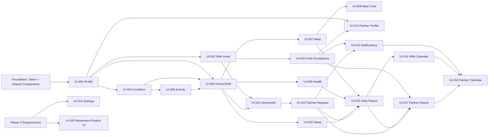

# Frontend Implementation Status

## Summary

현재 Flutter Frontend에는 앱 초기화 화면과 Web 전용 모션 인식 데모만 구현되어 있다. 제품 UI는 STEP 1~5에서 요구사항, Architecture, Design System, Component System, 화면별 구현 계획까지 문서화되었으며 실제 Page, 공통 Component, Design Token, Router, Mock Service는 아직 없다.

이 문서는 제품 UI Task의 상태판이다. 작업자는 시작할 때 `Owner`, `Status`, `Branch`를 갱신하고 Handoff 시 해당 Task 문서의 `Handoff Output`을 작성한다. Status는 `Todo`, `Doing`, `Review`, `Done`, `Blocked` 중 하나만 사용한다.

## Screen Status

| Task | Screen | Feature | Owner | Status | Branch | Route | Notes |
|---|---|---|---|---|---|---|---|
| UI-001 | SCR-W-01 임산부 프로필 설정 | profile | Unassigned | Todo | - | TBD (`/onboarding/profile`, `/wife/profile` 후보) | Not Implemented |
| UI-002 | SCR-W-14 배우자 초대 | invitation | Unassigned | Todo | - | TBD (`/onboarding/invite`, `/wife/invite` 후보) | Not Implemented |
| UI-003 | SCR-H-06 초대 수락 | invitation | Unassigned | Todo | - | TBD (`/invitation-entry` 후보) | Not Implemented; 외부 Deep Link 계약 미정 |
| UI-004 | SCR-W-02 오늘의 컨디션 | condition | Unassigned | Todo | - | TBD (`/wife/home/condition` 후보) | Not Implemented |
| UI-005 | SCR-W-03 오늘 예정 활동 | condition | Unassigned | Todo | - | TBD (`/wife/home/activity` 후보) | Not Implemented |
| UI-006 | SCR-W-04 통합 홈 | routine | Unassigned | Todo | - | TBD (`/wife/home` 후보) | Not Implemented; Router/Shell 통합 Task |
| UI-007 | SCR-W-05 식사 가이드 | meal | Unassigned | Todo | - | TBD (`/wife/home/meal` 후보) | Not Implemented |
| UI-008 | SCR-W-10 식사 재조정 채팅 | meal | Unassigned | Todo | - | TBD (`/wife/meal-chat` 후보) | Not Implemented |
| UI-009 | SCR-W-08 건강 가이드 | health | Unassigned | Todo | - | TBD (`/wife/home/health` 후보) | Not Implemented |
| UI-010 | SCR-W-09 수면 가이드 | sleep | Unassigned | Todo | - | TBD (`/wife/home/sleep` 후보) | Not Implemented |
| UI-011 | SCR-W-06 가사 가이드 | household | Unassigned | Todo | - | TBD (`/wife/home/household` 후보) | Not Implemented |
| UI-012 | SCR-H-04 파트너 가사 요청 | household | Unassigned | Todo | - | TBD (`/partner/requests/:requestId` 후보) | Not Implemented |
| UI-013 | SCR-H-05 파트너 프로필 | profile | Unassigned | Todo | - | TBD (`/partner/profile` 후보) | Not Implemented |
| UI-014 | SCR-H-03 알림 | notification | Unassigned | Todo | - | TBD (`/partner/notifications` 후보) | Not Implemented; Push 제외 |
| UI-015 | SCR-W-11 Daily 리포트 | report | Unassigned | Todo | - | TBD (`/wife/calendar/report/:date` 후보) | Not Implemented |
| UI-016 | SCR-W-12 컨디션 캘린더 | report | Unassigned | Todo | - | TBD (`/wife/calendar` 후보) | Not Implemented |
| UI-017 | SCR-H-01 파트너 아침 리포트 | report | Unassigned | Todo | - | TBD (`/partner/report/:date` 후보) | Not Implemented |
| UI-018 | SCR-H-02 파트너 캘린더 | report | Unassigned | Todo | - | TBD (`/partner/calendar` 후보) | Not Implemented; Partner Main |
| UI-019 | SCR-W-13 설정 | settings | Unassigned | Blocked | - | TBD (`/wife/settings` 후보) | Not Implemented; 상세 요구사항 미정인 Phase 2 플레이스홀더 |
| UI-020 | SCR-W-07 실시간 모션 | movement | Unassigned | Todo | - | TBD (`/wife/movement`, `/partner/movement` 후보) | Partially Implemented: Web 카메라/WebSocket 데모만 존재, 제품 화면은 Phase 2 |

## Shared Components

제품용 공통 Component는 아직 존재하지 않는다.

| Component | 존재 여부 | 현재 사용 위치 | 재사용 가능 여부 | 수정 주의사항 |
|---|---|---|---|---|
| `AppButton`, `AppIconButton` | 없음 | - | 구현 후 전체 제품 UI | Foundation Owner만 API 변경 |
| `AppTextField`, `AppSelectionCard` | 없음 | - | Profile, Condition, Activity, Sleep | 입력·선택 Semantics와 오류 계약 유지 |
| `AppCard`, `AppChip`, `AppBanner`, `AppDialog` | 없음 | - | 제품 UI 전반 | Feature 비즈니스 규칙을 넣지 않음 |
| `AppProgressMetric`, `AppSkeleton` | 없음 | - | Condition, Loading 상태 | 색만으로 상태를 표현하지 않음 |
| `ResponsivePageContent` | 없음 | - | 모든 Page | `core/responsive`에 동명 구현을 중복 생성하지 않음 |
| `AppTopBar`, `AppShell`, `AppBottomNavigation` | 없음 | - | 역할별 화면 | Partner Tab은 미정이므로 Item 주입형 유지 |
| `LoadingState`, `EmptyState`, `ErrorState` | 없음 | - | 비동기 화면 | 범용 상태 Wrapper로 과도하게 합치지 않음 |
| `CategoryBadge`, `StatusBadge`, `GuideTaskCard` | 없음 | - | Routine, Guide, Report | `AppChip`과 Domain 상태 Mapping 책임을 구분 |
| Material `Card`, `OutlinedButton`, `AppBar` | 있음 | `app.dart` 임시 실행 화면 | 제품 공통으로 재사용하지 않음 | 제품 화면 도입 시 임시 화면과 함께 제거 |
| `_PostureBadge`, `MovementOverlayPainter` | 있음 | `features/movement` 데모 | 공통화하지 않음 | Backend enum/Canvas에 결합된 데모 전용 구현 보존 |

Component의 상세 Props와 Variant는 `04_component_system.md`를 단일 기준으로 사용한다.

## Design System

| 영역 | 상태 | 현재 코드 | 구현 기준 |
|---|---|---|---|
| Colors | 미구현 | `Colors.indigo`, 개별 Material Color 사용 | `AppColors` |
| Typography | 미구현 | 개별 `TextStyle` 사용 | `AppTypography` |
| Spacing | 미구현 | 개별 `SizedBox`, `EdgeInsets` 사용 | `AppSpacing` |
| Radius | 미구현 | Material 기본값/개별 값 | `AppRadius` |
| Elevation | 미구현 | Material 기본 Card | `AppElevation` |
| Responsive Breakpoints | 미구현 | 제품 Page 없음 | `AppBreakpoints` |
| Theme | 부분 구현 | `ColorScheme.fromSeed(Colors.indigo)` 임시 Theme | `AppTheme`으로 교체 필요 |

Token 값과 Flutter Mapping은 `DESIGN.md`, `03_design_system.md`를 따른다. Token 파일을 여러 Feature에서 각자 만들지 않는다.

## Mock Services

현재 제품용 Mock Data, Service Interface, Mock Service, App Dependency 조립은 구현되어 있지 않다. 기존 `MovementController`의 `CameraFrameSource`와 `LiveTransport`는 테스트 Fake 주입 경계지만 제품 Mock Service 체계는 아니다.

구현 규칙:

```text
Page → Feature Widget → State/Controller → Service Interface → MockService
```

- Mock Fixture를 Page나 Widget에 직접 작성하지 않는다.
- 빈 `ApiService` 또는 임의 Endpoint를 만들지 않는다.
- Service 선택은 향후 `app_dependencies.dart` 한 곳에서 수행한다.
- Feature 간 공유 결과는 공통 Mock Store/Service 재조회 또는 필요한 범위의 Stream으로 전달한다.

## Known Issues

- `go_router`, `provider` 등 Router/상태관리 Package는 제안 상태이며 설치되지 않았다.
- 제품 Route, 역할 Redirect, Not Found, 초대 Deep Link 외부 URL이 구현되지 않았다.
- `app.dart`는 임시 실행 화면과 Web 전용 Movement Adapter를 직접 Import한다.
- 제품용 Design Token과 공통 Component가 없어 기존 데모는 스타일 값을 직접 사용한다.
- Android/iOS 정식 플랫폼 프로젝트가 저장소에 없고 `dart:html` Adapter 때문에 현재 앱은 Web 전용이다.
- `.env`가 Flutter asset이라 파일이 없으면 실행/빌드가 실패한다.
- Partner Bottom Navigation 항목, 설정 상세, 초대 Token/인증 복귀 계약은 미정이다.
- 실시간 모션 제품 화면은 MVP 제외다. 기존 Demo는 단일 세션 Backend와 실제 브라우저 수동 검증에 의존한다.
- Backend가 없는 제품 Feature의 Loading/Empty/Error/성공 상태는 아직 Mock으로 재현되지 않는다.

## Integration Notes

충돌 위험이 높은 공통 파일은 Integration Owner 한 명만 수정한다.

| 파일/영역 | 위험 | 규칙 |
|---|---|---|
| `frontend/lib/app.dart` | 앱 진입, Theme, Dependency 조립 동시 변경 | Integration Owner 전용 |
| `frontend/lib/core/navigation/router.dart` | 모든 Feature Route 등록 | Integration Owner 전용; Feature는 Route Descriptor/Builder만 제공 |
| `frontend/lib/core/navigation/app_routes.dart` | Route 이름·Path 계약 | 임의 변경 금지; 변경 전 두 작업자 합의 |
| `frontend/lib/core/theme/**` 또는 `design_system/tokens/**` | 전 화면 시각 영향 | Foundation 완료 후 API Freeze |
| `frontend/lib/design_system/components/**` | Props 변경 시 다수 Feature 영향 | Shared Component Owner 리뷰 필수 |
| `frontend/lib/widgets/**` | Shell/상태 UI 중복과 충돌 | 새 공통화 전 기존 목록 확인 |
| `frontend/lib/core/di/app_dependencies.dart` | Mock 구현 선택과 전역 Store | Integration Owner 전용 |
| `frontend/pubspec.yaml`, `pubspec.lock` | Package/Asset 충돌 | Integration Owner만 변경, 사전 승인 필요 |
| `frontend/lib/features/movement/**` | 동작 중인 Web 데모 회귀 | UI-020 전에는 수정하지 않음 |

Feature Branch는 자신의 `features/<feature>/**`와 관련 Test를 우선 수정한다. 공통 변경이 필요하면 별도 작은 Commit으로 분리해 Integration Owner가 먼저 병합한다.

## Dependency Graph



Foundation은 별도 화면 Task가 아니라 UI-001 착수 전 Integration Owner가 `03_design_system.md`와 `04_component_system.md`의 최소 세트를 구현·검토하는 선행 작업이다.

## Parallelizable Tasks

| Wave | 병렬 가능 Task | 조건 |
|---|---|---|
| 0 | Foundation / Route skeleton | 두 작업자가 나누지 않고 Integration Owner가 순차 확정 |
| 1 | UI-002와 UI-004 | UI-001 완료 후 서로 다른 Feature에서 진행 |
| 2 | UI-003와 UI-005 | 각각 UI-002, UI-004 완료 후 진행 |
| 3 | UI-007, UI-009, UI-010, UI-011, UI-013 | UI-006 완료 및 공통 Component API Freeze 후 Feature별 병렬 진행 |
| 4 | UI-008와 UI-012 | 각각 UI-007, UI-011 완료 후 병렬 진행 |
| 5 | UI-014와 UI-015 | UI-014용 Report Route Placeholder 계약을 Integration Owner가 먼저 제공 |
| 6 | UI-016과 UI-017 | UI-015 완료 후 Wife/Partner Report Slice로 병렬 진행 |
| 7 | UI-018 | UI-014, UI-016, UI-017 통합 후 진행 |
| Phase 2 | UI-019, UI-020 | 요구사항과 정책 확정 전 착수 금지 |

## Conflict-prone Tasks

- UI-001: 최초 Foundation, Theme와 Dependency 조립을 함께 건드릴 가능성이 높다.
- UI-006: `app.dart`, Router, Wife Shell, Bottom Navigation의 Integration 지점이다.
- UI-011/UI-012/UI-015/UI-017: 동일한 Household Request와 Report Projection Mock Store를 공유한다.
- UI-014/UI-017/UI-018: Partner Shell, Notification badge, Partner Main Route에서 충돌할 수 있다.
- UI-015/UI-016/UI-017/UI-018: `features/report/**`를 공유하므로 파일 단위 Owner를 먼저 나눈다.
- UI-020: 기존 `features/movement/**`, Shell Tab, Lifecycle 정리를 동시에 건드린다.

## Recommended Ownership

### Developer A — Integration Owner / Identity & Daily Core

- Foundation Token, Theme, Design System Component와 Shared Shell
- UI-001 Profile
- UI-002 Wife Invitation
- UI-003 Invitation Acceptance
- UI-004 Condition
- UI-005 Planned Activity
- UI-006 Home 및 Navigation Integration
- UI-013 Partner Profile
- 공통 파일: `app.dart`, Router, `app_dependencies.dart`, `pubspec.yaml`

### Developer B — Care & Record Vertical Slices

- UI-007 Meal
- UI-008 Meal Chat
- UI-009 Health
- UI-010 Sleep
- UI-011/UI-012 Household Request 양쪽 흐름
- UI-014 Notification
- UI-015~UI-018 Report/Calendar

Developer B는 Wave 0~2 동안 Task 문서 검토, Feature Model/Fixture 초안 또는 공통 Component Review를 수행하고, UI-006 Integration Contract가 Freeze된 뒤 Guide Slice를 병렬 구현한다. UI-019/UI-020은 Phase 2 결정 후 별도 재배정한다.

## Shared File Ownership

1. Developer A를 기본 Integration Owner로 지정한다. 팀 합의로 바꿀 수 있지만 동시에 두 명이 맡지 않는다.
2. Integration Owner만 `app.dart`, Router 등록부, Theme/Token, `app_dependencies.dart`, `pubspec.yaml`을 직접 병합한다.
3. Developer B가 공통 변경을 필요로 하면 Feature Branch에서 임의 수정하지 않고 필요한 API와 사용 사례를 먼저 제안한다.
4. Shared API 변경은 작은 선행 PR로 분리하고 두 작업자가 반영한 뒤 Feature PR을 진행한다.
5. Route와 Model 이름을 바꿀 때 관련 Task, `ROUTE_MAP.md`, 상태표를 같은 변경에서 갱신한다.
6. Integration Owner는 각 Feature가 제공한 Route Builder를 중앙 Router에 연결하고 역할 Redirect/Browser Back 회귀를 검증한다.
