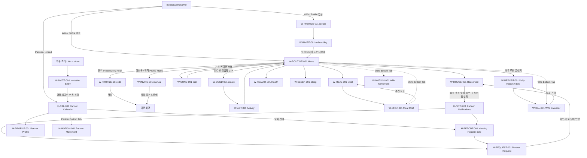

# Frontend Route Map

## 1. 기준과 현재 상태

이 문서는 `docs/서비스흐름도/01~09`, `docs/requirements/01_MVP.md`, `01_PRD.md`, `03_유스케이스명세서.md`, `04_1_기능요구사항명세서.md`를 다시 대조해 생성한 Frontend 내부 Route 계약이다.

- 제품 화면 20개와 재사용 진입 경로가 Flutter 기본 `Navigator` 기반 Skeleton Router에 등록되어 있다.
- 아래 Path는 Frontend 내부 경로다. 외부 초대 Domain, ThinQ 인증 복귀 URL, Backend Endpoint 계약이 아니다.
- 날짜·요청 ID·초대 Token은 URL에서 보존하고 화면 생성자에 전달한다.
- 인증·Session Adapter가 없어 실제 자동 Redirect와 권한 Guard는 `PARTIAL`이다.
- 실시간 모션과 설정은 접근 가능한 Placeholder만 제공하며 실제 기능은 Phase 2다.

### 요구사항 ID 추적 규칙

- Source of Truth는 `docs/requirements/04_1_기능요구사항명세서.md`의 기능 요구사항 ID다.
- 별도 Screen ID는 정의하지 않는다. Route와 화면은 관련 `W-*`·`H-*` ID를 하나 이상 연결해 추적한다.
- 하나의 화면이 여러 기능을 담당하면 관련 요구사항 ID를 모두 기록하고, 표의 첫 ID만 대표 ID로 사용한다.
- 공유 실시간 화면은 역할에 따라 `W-MOTION-001`과 `H-MOTION-001`을 함께 연결한다.

## 2. Bootstrap 계약

앱 시작 시 Session Adapter가 다음 상태를 판정해 시작 경로를 결정한다.

| 상태 | 시작 경로 | 현재 구현 |
| --- | --- | --- |
| 아내, 프로필 없음 | `/onboarding/profile` | Resolver 계약 구현, `/`의 Skeleton 기본값 |
| 아내, 프로필 있음 | `/wife/home` | Resolver 계약 구현, 실제 Session 연결 TODO |
| 남편, 계정 연동 완료 | `/partner/calendar` | Resolver 계약 구현, 실제 Session 연결 TODO |
| 남편, 초대 링크 진입 | `/invitation-entry?token={token}` | Token 파싱 구현, 검증/인증 복귀 TODO |

`/`은 인증 상태가 없는 Skeleton 실행 환경에서 최초 등록 화면으로 연결한다. 제품 연결 시 `AppRouter.resolveLaunchRoute`에 실제 Session 상태를 주입한다.

## 3. Route Table

| 관련 요구사항 ID | 화면 | 내부 Route | 진입 | 다음 경로 | Context/Parameter | 상태 |
| --- | --- | --- | --- | --- | --- | --- |
| W-PROFILE-001 W-PROFILE-002 W-PROFILE-003 | 임산부 프로필 설정/수정 | `/onboarding/profile`, `/wife/profile` | Bootstrap 또는 전역 프로필 메뉴 | 최초 등록은 W-INVITE-001, 수정은 이전 화면 | Path로 `ProfileMode` 구분 | SKELETON |
| W-INVITE-001 W-INVITE-002 | 배우자 초대 | `/onboarding/invite`, `/wife/invite` | 최초 등록 완료 또는 미연동 전역 메뉴 | 온보딩은 W-ROUTINE-001, 수동 진입은 이전 화면 | Path로 `InviteEntryContext` 구분 | SKELETON |
| H-INVITE-001 | 초대 수락 | `/invitation-entry?token={token}` | 외부 초대 Link Adapter | 성공 시 H-CAL-001 | `token`; 외부 Domain/인증 복귀 TBD | SKELETON |
| W-COND-001 W-COND-002 | 오늘의 컨디션 | `/wife/home/condition?mode=create|edit` | Home CTA 또는 수정 Action | 최초 입력은 W-ACT-001, 수정은 W-ROUTINE-001 | `mode`, 당일 날짜는 State/Service | SKELETON |
| W-ACT-001 | 오늘 예정 활동 | `/wife/home/activity` | W-COND-001 최초 저장 | W-ROUTINE-001 | 당일 Context는 Service | SKELETON |
| W-ROUTINE-001 W-ROUTINE-002 W-ROUTINE-003 | 통합 홈 | `/wife/home` | Bootstrap, 초대 종료, 활동 저장 | Guide, Report, Calendar, 전역 메뉴 | 없음 | SKELETON |
| W-MEAL-001 W-MEAL-002 W-MEAL-003 W-MEAL-004 W-RECORD-001 | 식사 가이드 | `/wife/home/meal` | Home 식사 영역 | W-CHAT-001 또는 Home | 날짜·끼니는 Feature State | SKELETON |
| W-HOUSE-001 W-HOUSE-002 W-HOUSE-003 W-RECORD-002 | 가사 가이드 | `/wife/home/household` | Home 가사 영역 | 요청 전송 결과 후 현재 화면/Home | 요청 생성은 상태/Modal, 남편 화면 직접 이동 금지 | SKELETON |
| W-MOTION-001 H-MOTION-001 | 공유 실시간 모션 | `/wife/movement`, `/partner/movement` | 역할별 하단 실시간 Tab만 | 역할별 이전 Tab | 역할은 Path, 계정 연동·동의 Guard TODO | SKELETON / PHASE 2 |
| W-HEALTH-001 W-HEALTH-002 W-RECORD-001 | 건강 가이드 | `/wife/home/health` | Home 건강 영역 | 완료 후 현재 화면/Home | 날짜·활동 ID는 Feature State | SKELETON |
| W-SLEEP-001 W-SLEEP-002 W-RECORD-001 | 수면 가이드 | `/wife/home/sleep` | Home 수면 영역 | 완료 후 현재 화면/Home | 날짜는 Feature State | SKELETON |
| W-MEAL-002 W-CHAT-001 W-CHAT-002 | 식사 재조정 채팅 | `/wife/meal-chat` | 식사 가이드 또는 Wife Chat Tab | 적용 시 W-MEAL-001 | Meal Context/Draft는 Feature State | SKELETON |
| W-REPORT-001 W-REPORT-002 | Daily 리포트 | `/wife/calendar/report/:date` | 하루 끝내기 또는 Wife Calendar | W-CAL-001/공유 Modal | `date` 필수 | SKELETON |
| W-CAL-001 | 컨디션 캘린더 | `/wife/calendar` | Wife Calendar Tab 또는 Report | 선택 날짜 W-REPORT-001 | 선택 날짜는 URL 이동 시 `date`로 전달 | SKELETON |
| W-SETTING-001 | 설정 | `/wife/settings` | Wife 전역 프로필 메뉴 | 이전 화면 | 상세 설정 요구사항 없음 | BLOCKED / PHASE 2 |
| H-REPORT-001 | 파트너 아침 리포트 | `/partner/report/:date` | 알림 또는 Partner Calendar | H-REQUEST-001 또는 이전 화면 | `date` 필수 | SKELETON |
| H-CAL-001 | 파트너 캘린더 | `/partner/calendar` | Bootstrap/연동 완료 | Report, Notification, Request, Profile | 선택 날짜는 Report `date`로 전달 | SKELETON |
| H-NOTI-001 | 파트너 알림 | `/partner/notifications` | Partner 전역 Bell | H-REPORT-001 또는 H-REQUEST-001 | 앱 내 Mock Inbox | SKELETON |
| H-REQUEST-001 H-REQUEST-002 H-REQUEST-003 | 파트너 가사 요청 | `/partner/requests/:requestId` | 알림, 리포트, 캘린더 | 상태 처리 후 Detail 유지/이전 화면 | `requestId` 필수 | SKELETON |
| H-PROFILE-001 | 파트너 프로필 | `/partner/profile` | Partner 전역 Profile Button | 이전 화면 | 조회 전용 | SKELETON |

## 4. 사용자 Route Flow

## 5. Route Context 계약

### 프로필과 초대

- `/onboarding/profile`은 `ProfileMode.create`다. 완료 시 `/onboarding/invite`로 이동한다.
- `/wife/profile`은 `ProfileMode.edit`다. 저장 또는 취소 시 진입 화면으로 돌아간다.
- `/onboarding/invite`는 `InviteEntryContext.onboarding`이다. 처리 후 Home으로 교체한다.
- `/wife/invite`는 `InviteEntryContext.profileMenu`다. 처리 후 진입 화면으로 돌아간다.
- 배우자 초대 메뉴 노출은 `partnerLinked == false`일 때만 허용한다.

### 컨디션

- 기본 `/wife/home/condition`은 최초 입력으로 처리하고 완료 시 Activity로 이동한다.
- `?mode=edit`는 기존 입력 수정으로 처리하고 완료 시 Home으로 이동한다.
- 오전 리포트 생성 실패가 컨디션 저장 성공을 취소하지 않는다.

### 동적 세그먼트

- `:date`는 ISO `YYYY-MM-DD`를 사용한다. Skeleton의 `today`는 실행 확인용 별칭이다.
- `:requestId`는 요청 Store의 식별자다. 빈 값·존재하지 않는 값의 Error UI는 Feature Task에서 구현한다.
- `token`은 Query에서 읽어 초대 화면에 전달한다. 로그나 사용자 노출 문구에 원문 Token을 출력하지 않는다.

### 역할과 권한

- Wife Route는 Wife Session, Partner Route는 연동 완료 Partner Session만 접근할 수 있어야 한다.
- 권한 없는 직접 URL의 Redirect 목적지는 인증/Host 계약 확정 후 중앙 Guard에서 결정한다.
- `/partner/movement`는 계정 연동 및 촬영/공유 동의가 없으면 진입을 제한한다.

## 6. Shared Navigation

### Wife Bottom Navigation

서비스 메뉴 구조 순서를 따른다.

1. Home → `/wife/home`
2. Realtime → `/wife/movement` (Phase 2 Placeholder)
3. Chat → `/wife/meal-chat`
4. Calendar → `/wife/calendar`

### Partner Bottom Navigation

요구사항에서 명시된 최소 전역 항목만 Skeleton에 둔다.

1. Calendar → `/partner/calendar`
2. Realtime → `/partner/movement` (Phase 2 Placeholder)

Partner의 추가 하단 Tab은 문서에 정의되지 않았으므로 임의 추가하지 않는다.

### Header

- Wife: 프로필 수정, 설정, 미연동 시 배우자 초대를 제공하는 Profile Menu.
- Partner: 알림 Bell과 조회 전용 Profile Button.
- 온보딩과 계정 화면은 역할별 Shell 밖에서 표시한다.

### Back과 Overlay

- Browser Back/Forward와 AppBar Back은 같은 Navigator Stack 의미를 사용한다.
- 수정/Draft가 있는 Profile, Condition, Activity, Chat은 이탈 확인을 적용한다.
- 저장·공유·요청 전송 결과는 새 Route가 아니라 원래 화면의 Modal/State로 처리한다.
- Modal이 열려 있으면 Route Pop보다 Modal 닫기가 우선한다.

## 7. 서비스 흐름 중 Route가 아닌 상태

다음 항목은 새 화면을 추가하지 않는다.

- AI 루틴 생성 Loading/Success/Fallback/Error
- 식사 추천 수락·거절·재시도
- 가사 요청 전송 성공·실패와 아내 측 요청 상태
- 건강·식사·수면 완료 체크
- 수면 설정 선택·수정·가전 실행 결과
- 초대 Token의 만료·사용됨·중복·서버 실패
- 실시간 로그 Empty/Error/동의 철회
- 루틴 실행 기록: 각 Guide의 공통 완료 상태로 누적

## 8. 구현 상태와 후속 작업

| 항목 | 상태 | 후속 작업 |
| --- | --- | --- |
| 중앙 Path 등록 | DONE | 화면 상세 구현 시 계약 유지 |
| 프로필/초대 진입 맥락 | DONE (Skeleton) | 실제 Controller State 연결 |
| `date`, `requestId`, `token` 파싱 | DONE (Skeleton) | 유효성 검증과 Store 조회 연결 |
| Wife/Partner Navigation | DONE (Skeleton) | Host Shell 연동 시 자체 Navigation 대체 가능 |
| 역할별 Header 진입점 | DONE (Skeleton) | 실제 연동 상태·Badge 주입 |
| Bootstrap Resolver 계약 | DONE | 실제 Session Adapter 연결 TODO |
| 인증·역할 Redirect Guard | TODO | 인증 정책 확정 후 중앙 Router에 구현 |
| Draft 이탈 확인 | TODO | 각 Feature Controller 구현 시 적용 |
| 외부 초대 Deep Link | TODO | Domain·로그인 복귀·Token 계약 필요 |
| Phase 2 Movement/Settings | DEFERRED | 요구사항·동의·개인정보 정책 확정 필요 |

## 9. Integration Rules

1. Feature Widget은 문자열 Path를 직접 만들지 않고 `RouteNames`와 Navigation Intent를 사용한다.
2. `date`, `requestId`, `token` 이름을 변경하면 이 문서, Router Test, 관련 Task를 함께 갱신한다.
3. Wife 화면에서 Partner 상세 Route로 직접 이동하지 않는다. 요청/알림은 Store 상태를 통해 역할 간 동기화한다.
4. 외부 초대 URL을 내부 `/invitation-entry`와 동일한 공개 계약으로 간주하지 않는다.
5. 역할 Redirect와 권한 없는 직접 URL 처리는 중앙 Router만 담당한다.
6. Settings 내용을 요구사항 없이 추가하지 않는다.
7. Movement Placeholder와 기존 Web Demo를 동일 기능으로 취급하지 않는다.
8. Route 변경 시 새로고침, Back/Forward, 직접 URL, 잘못된 Parameter Test 결과를 Handoff에 남긴다.
