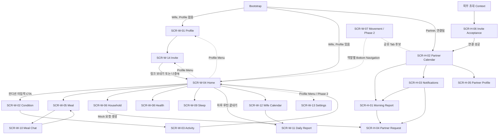

# Frontend Route Map

## Route Status Notice

현재 제품 Router는 구현되지 않았고 Route Path는 `02_frontend_architecture.md`의 내부 후보일 뿐이다. 아래 표의 모든 경로는 `TBD`이며 Backend Endpoint 또는 외부 Deep Link 계약이 아니다. 구현 전 Integration Owner가 `go_router` 도입 여부와 함께 확정해야 한다.

## Route Table

| Screen ID | Screen | Route | Entry From | Exit To | Parameters | Back Behavior | Status |
|---|---|---|---|---|---|---|---|
| SCR-W-01 | 임산부 프로필 설정 | TBD: `/onboarding/profile`, `/wife/profile` 후보 | Bootstrap 또는 Wife Profile Menu | SCR-W-14 또는 이전 화면 | `mode`는 Route가 아닌 진입 상태 후보 | 최초 등록 중 이탈 확인; 수정은 이전 화면 | Todo |
| SCR-W-14 | 배우자 초대 | TBD: `/onboarding/invite`, `/wife/invite` 후보 | 최초 Profile 완료 또는 Profile Menu | SCR-W-04 또는 이전 화면 | `entryContext` 후보 | 온보딩은 Home, 수동 진입은 이전 화면 | Todo |
| SCR-H-06 | 초대 수락 | TBD: `/invitation-entry` 후보 | 외부 초대 Adapter | SCR-H-02 | 초대 Context 형식 TBD | 외부 진입/인증 상태별 정책 TBD | Todo |
| SCR-W-02 | 오늘의 컨디션 | TBD: `/wife/home/condition` 후보 | SCR-W-04 | SCR-W-03 또는 SCR-W-04 | 수정 여부/날짜는 State 후보 | 미저장 이탈 확인 후 Home | Todo |
| SCR-W-03 | 오늘 예정 활동 | TBD: `/wife/home/activity` 후보 | SCR-W-02 | SCR-W-04 | 당일 Context는 Service 조회 | 미저장 선택이 있으면 확인 후 이전 | Todo |
| SCR-W-04 | 통합 홈 | TBD: `/wife/home` 후보 | Bootstrap, Invite, Condition/Activity | Guide, Calendar, Profile Menu | 없음 | Wife Shell Root이므로 앱 종료/Browser History 정책 | Todo |
| SCR-W-05 | 식사 가이드 | TBD: `/wife/home/meal` 후보 | SCR-W-04 | SCR-W-10 또는 SCR-W-04 | 날짜/끼니 선택은 State 후보 | Home으로 복귀 |
| SCR-W-06 | 가사 가이드 | TBD: `/wife/home/household` 후보 | SCR-W-04 | Modal 또는 SCR-W-04 | 날짜 Context는 Service 조회 | Modal 우선 닫고 Home으로 복귀 | Todo |
| SCR-W-07 | 실시간 모션 | TBD: `/wife/movement`, `/partner/movement` 후보 | 역할별 Bottom Navigation | 역할별 이전 Tab | 역할/세션 Context TBD | Shell 이전 Tab; Camera/Socket 정리 | Todo / Phase 2 |
| SCR-W-08 | 건강 가이드 | TBD: `/wife/home/health` 후보 | SCR-W-04 | 콘텐츠/완료 후 현재 화면 또는 Home | 날짜/활동 ID 후보 | Home으로 복귀 | Todo |
| SCR-W-09 | 수면 가이드 | TBD: `/wife/home/sleep` 후보 | SCR-W-04 | 완료 후 현재 화면 또는 Home | 날짜 Context는 Service 조회 | Home으로 복귀 | Todo |
| SCR-W-10 | 식사 재조정 채팅 | TBD: `/wife/meal-chat` 후보 | SCR-W-05 | SCR-W-05 | 선택 Meal Context 전달 방식 TBD | 적용 전 Draft가 있으면 이탈 확인 | Todo |
| SCR-W-11 | Daily 리포트 | TBD: `/wife/calendar/report/:date` 후보 | 하루 끝내기 또는 SCR-W-12 | SCR-W-12/공유 Modal | `date` | Calendar 진입은 Calendar, 완료 직후 정책 TBD | Todo |
| SCR-W-12 | 컨디션 캘린더 | TBD: `/wife/calendar` 후보 | Wife Navigation 또는 SCR-W-11 | SCR-W-11 | 선택 날짜는 URL/State 정책 TBD | Wife Shell 이전 Tab | Todo |
| SCR-W-13 | 설정 | TBD: `/wife/settings` 후보 | Wife Profile Menu | 이전 화면 | 없음 | 이전 화면 | Blocked / Phase 2 |
| SCR-H-01 | 파트너 아침 리포트 | TBD: `/partner/report/:date` 후보 | 알림 또는 SCR-H-02 | SCR-H-04 또는 SCR-H-02 | `date` | 진입 화면으로 복귀 | Todo |
| SCR-H-02 | 파트너 캘린더 | TBD: `/partner/calendar` 후보 | 연결 완료/Bootstrap | SCR-H-01/03/04/05 | 선택 날짜 정책 TBD | Partner Shell Root | Todo |
| SCR-H-03 | 알림 | TBD: `/partner/notifications` 후보 | Partner AppBar Bell | SCR-H-01 또는 SCR-H-04 | 없음 | 이전 Partner 화면 | Todo |
| SCR-H-04 | 파트너 가사 요청 | TBD: `/partner/requests/:requestId` 후보 | 알림/리포트/캘린더 | 이전 Partner 화면 | `requestId` | 상태 처리 후에도 Detail 유지, Back은 진입 화면 | Todo |
| SCR-H-05 | 파트너 프로필 | TBD: `/partner/profile` 후보 | Partner 전역 Profile Button | 이전 Partner 화면 | 없음 | 이전 화면 | Todo |

## User Flow

## Route Contract

### SCR-W-01

- Route: TBD; `/onboarding/profile`, `/wife/profile` 후보
- Entry: Bootstrap 또는 Wife Profile Menu
- Parameters: 최초 등록/수정 Mode 전달 방식 TBD
- Return: 수정 성공 여부 또는 없음
- Next: 최초 완료는 SCR-W-14, 수정 완료는 이전 화면
- Back: 최초 등록은 미완료 이탈 확인, 수정은 이전 화면
- Notes: 6개 Step은 하나의 Wizard Route이며 Browser History 분리는 요구 확정 전 금지

### SCR-W-14

- Route: TBD; `/onboarding/invite`, `/wife/invite` 후보
- Entry: 최초 Profile 완료 또는 미연동 Wife Profile Menu
- Parameters: 자동/수동 Entry Context 전달 방식 TBD
- Return: 공유 결과/건너뜀 상태
- Next: 자동 진입은 SCR-W-04, 수동 진입은 이전 화면
- Back: Entry Context에 따라 Next와 동일
- Notes: 공유 완료는 Modal이며 Route가 아님

### SCR-H-06

- Route: TBD; `/invitation-entry` 후보
- Entry: 외부 Invite Entry Adapter
- Parameters: 초대 Token, Domain, 인증 복귀 형식 TBD
- Return: 없음
- Next: 연결 완료 시 SCR-H-02
- Back: 외부 진입과 로그인 필요 상태 정책 TBD
- Notes: 유효/만료/사용됨/중복/실패 상태는 Mock Scenario로 제공

### SCR-W-02

- Route: TBD; `/wife/home/condition` 후보
- Entry: SCR-W-04 CTA 또는 수정 Action
- Parameters: 수정 여부와 날짜 전달 방식 TBD
- Return: 저장된 당일 Condition
- Next: 최초 입력은 SCR-W-03, 수정은 SCR-W-04
- Back: 변경값이 있으면 이탈 확인 후 SCR-W-04
- Notes: Partner Report 생성 실패가 Condition 저장을 실패시키지 않음

### SCR-W-03

- Route: TBD; `/wife/home/activity` 후보
- Entry: SCR-W-02 저장 완료
- Parameters: 없음; 당일 Context는 Service 조회
- Return: 선택된 Activity ID 목록
- Next: SCR-W-04 생성 상태
- Back: 미저장 변경 확인 후 SCR-W-02 또는 Home
- Notes: 복수 선택

### SCR-W-04

- Route: TBD; `/wife/home` 후보
- Entry: Bootstrap, Invite 종료, Condition/Activity 완료
- Parameters: 없음
- Return: 없음
- Next: SCR-W-02/05/06/08/09/11/12 및 Profile Menu
- Back: Wife Shell Root 정책
- Notes: 컨디션 미입력 시 CTA만, 입력 완료 시 4개 Guide를 같은 Page에서 표시

### SCR-W-05

- Route: TBD; `/wife/home/meal` 후보
- Entry: SCR-W-04 Meal Summary
- Parameters: 날짜/끼니 URL 반영 여부 TBD
- Return: 수락/거절/공유된 Meal 상태
- Next: SCR-W-10 또는 SCR-W-04
- Back: SCR-W-04
- Notes: 추천 결과와 오류는 Mock Service가 제공

### SCR-W-06

- Route: TBD; `/wife/home/household` 후보
- Entry: SCR-W-04 Household Summary
- Parameters: 없음
- Return: 직접 수행 및 Partner Request 상태
- Next: 공유 결과 Modal 또는 SCR-W-04
- Back: 열린 Modal을 먼저 닫고 SCR-W-04
- Notes: 가전은 추천만 표시하며 실제 실행 금지

### SCR-W-07

- Route: TBD; 역할별 `/movement` 후보
- Entry: 역할별 Bottom Navigation만 허용
- Parameters: 역할/세션 Context TBD
- Return: 없음
- Next: 역할별 이전 Tab
- Back: Camera/WebSocket을 정리하고 이전 Tab
- Notes: Phase 2. 기존 Navigator 기반 Demo Route와 제품 Route를 동일시하지 않음

### SCR-W-08

- Route: TBD; `/wife/home/health` 후보
- Entry: SCR-W-04 Health Summary
- Parameters: 날짜/Activity ID 방식 TBD
- Return: 완료된 Activity 상태
- Next: 콘텐츠 또는 SCR-W-04
- Back: SCR-W-04
- Notes: MVP는 모션이 아닌 Condition 기반 추천

### SCR-W-09

- Route: TBD; `/wife/home/sleep` 후보
- Entry: SCR-W-04 Sleep Summary
- Parameters: 없음
- Return: 선택 환경과 수행 기록
- Next: 현재 화면 완료 상태 또는 SCR-W-04
- Back: SCR-W-04
- Notes: 실제 가전 명령 금지

### SCR-W-10

- Route: TBD; `/wife/meal-chat` 후보
- Entry: SCR-W-05 재추천 Action
- Parameters: 선택 Meal Context 전달 방식 TBD
- Return: 적용된 대체 Meal
- Next: SCR-W-05
- Back: 미적용 Draft/추천이 있으면 이탈 확인
- Notes: MVP는 식사 재조정만 허용

### SCR-W-11

- Route: TBD; `/wife/calendar/report/:date` 후보
- Entry: SCR-W-04 하루 끝내기 또는 SCR-W-12 날짜 선택
- Parameters: `date`
- Return: 저장/공유 결과
- Next: SCR-W-12 또는 공유 Modal
- Back: Calendar 진입은 SCR-W-12, 완료 직후 정책 TBD
- Notes: 모션·가전 이력은 MVP Report에서 제외

### SCR-W-12

- Route: TBD; `/wife/calendar` 후보
- Entry: Wife Navigation 또는 SCR-W-11
- Parameters: 선택 날짜 URL 반영 여부 TBD
- Return: 선택 날짜
- Next: SCR-W-11
- Back: Wife Shell 이전 Tab
- Notes: 날짜 선택은 Keyboard Grid를 지원

### SCR-W-13

- Route: TBD; `/wife/settings` 후보
- Entry: Wife Profile Menu
- Parameters: 없음
- Return: 없음
- Next: 이전 화면
- Back: 이전 화면
- Notes: 상세 요구사항 미정으로 Blocked; 임의 설정 항목 금지

### SCR-H-01

- Route: TBD; `/partner/report/:date` 후보
- Entry: SCR-H-03 또는 SCR-H-02 선택 날짜
- Parameters: `date`
- Return: 없음
- Next: SCR-H-04 또는 SCR-H-02
- Back: 진입 화면
- Notes: 공유 허용 정보만 읽기 전용 제공

### SCR-H-02

- Route: TBD; `/partner/calendar` 후보
- Entry: 연결 완료 또는 Bootstrap Partner Redirect
- Parameters: 선택 날짜 URL 반영 여부 TBD
- Return: 없음
- Next: SCR-H-01/03/04/05
- Back: Partner Shell Root 정책
- Notes: Partner Bottom Navigation 항목은 미정

### SCR-H-03

- Route: TBD; `/partner/notifications` 후보
- Entry: Partner AppBar Bell
- Parameters: 없음
- Return: 읽음 상태
- Next: SCR-H-01 또는 SCR-H-04
- Back: 이전 Partner 화면
- Notes: Push Infra는 Phase 2, MVP는 앱 내 Mock Inbox

### SCR-H-04

- Route: TBD; `/partner/requests/:requestId` 후보
- Entry: SCR-H-03, SCR-H-01, SCR-H-02
- Parameters: `requestId`
- Return: requested/acknowledged/completed 상태
- Next: Detail 유지 또는 이전 화면
- Back: 진입 화면
- Notes: 허용된 다음 상태 Action만 노출

### SCR-H-05

- Route: TBD; `/partner/profile` 후보
- Entry: Partner 전역 Profile Button
- Parameters: 없음
- Return: 없음
- Next: 이전 화면
- Back: 이전 화면
- Notes: 별도 Menu 없이 직접 진입하며 읽기 전용

## Shared Navigation

### Bottom Navigation

- 독립 실행 모드에서만 자체 `AppBottomNavigation`을 사용하고 ThinQ Host Shell이 있으면 Host를 우선한다.
- Wife의 Home/Calendar 및 Phase 2 Movement 관계는 후보이며 최종 Item 목록은 구현 전 확인한다.
- Partner Bottom Navigation 구성은 문서에 확정되지 않았으므로 주입형으로 유지한다.
- Movement Tab이 비활성화되면 Camera와 WebSocket을 즉시 정리해야 한다.

### Header Navigation

- 모든 제품 화면 우측 상단에 역할별 Profile Button을 제공한다.
- Wife는 Profile 수정/설정/미연동 시 초대 Menu를 연다.
- Partner는 Menu 없이 SCR-H-05로 직접 이동한다.
- Partner AppBar Bell은 SCR-H-03으로 이동한다.

### Back

- Browser Back/Forward와 App Bar Back이 같은 Route Stack 의미를 가져야 한다.
- Form Draft나 Chat Draft가 있으면 문서에 정의된 경우에만 이탈 확인을 사용한다.
- Modal이 열려 있으면 Route Pop보다 Modal 닫기가 우선이다.

### Modal

- 공유 완료, 저장 완료, 재시도 확인은 Route가 아니라 원래 Context로 결과를 반환하는 Overlay다.
- Modal 안에서 새 Feature Route 문자열을 직접 사용하지 않는다.

### Deep Link 가능성

- SCR-H-06은 외부 초대 Deep Link 진입 가능성이 있다.
- SCR-W/H Report와 Partner Request는 복원 가치가 있어 Named Route 후보로 유지한다.
- 외부 Domain, Token 이름, 로그인/가입 복귀 URL은 계약 전까지 `TBD`다.

## Integration Rules

1. Route 이름과 Path를 Task 내부에서 임의 변경하지 않는다.
2. `TBD` 후보를 외부 공개 URL 또는 Backend Endpoint로 문서화하지 않는다.
3. Parameter 이름을 변경하려면 관련 Task 문서와 이 Route Map을 함께 갱신한다.
4. 다른 Feature Route 수정은 Integration Owner와 사전 확인한다.
5. Feature Widget은 문자열 Path나 `Navigator.push`를 직접 호출하지 않고 Navigation Intent를 상위에 전달한다.
6. 중앙 Router의 대규모 Refactor를 Feature PR에 섞지 않는다.
7. 역할 Redirect와 권한 없는 Route의 Main 복귀는 중앙 Router에서 처리한다.
8. Partner Navigation 항목과 Settings 내용을 요구사항 없이 고정하지 않는다.
9. UI-020 전에는 기존 Movement Demo Navigation과 파일을 변경하지 않는다.
10. Route를 구현한 Task는 Browser 새로고침, Back/Forward, 직접 URL, 잘못된 Parameter Test 결과를 Handoff에 남긴다.
