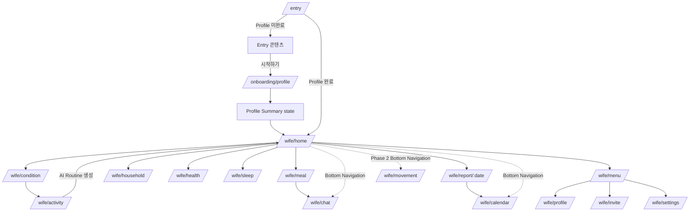
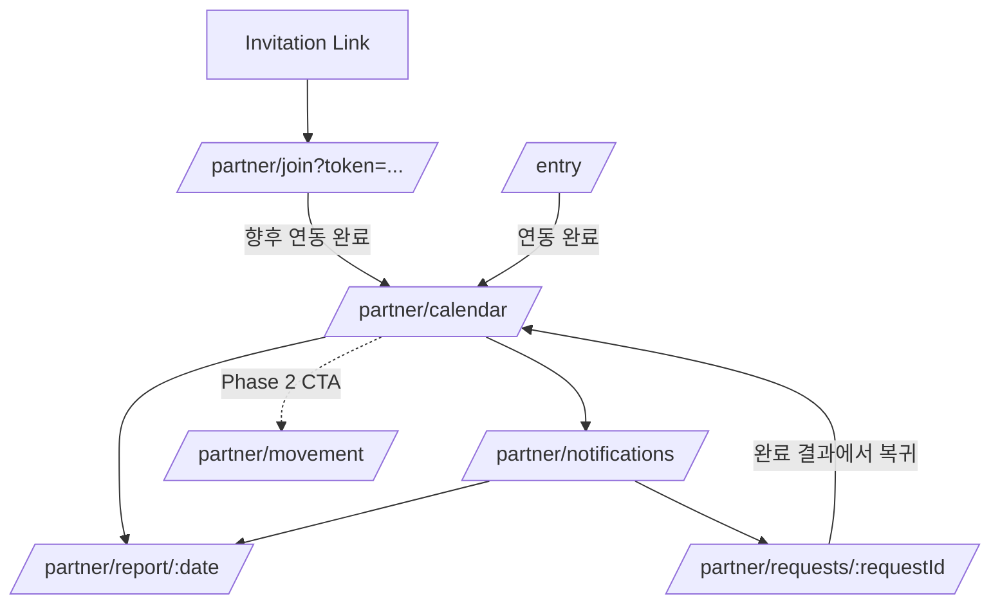

# Frontend Route Map

## 1. 목적과 기준

이 문서는 최신 기능 요구사항과 화면 설계에 맞춘 Frontend Route 계약이다. 현재 Flutter 구현의 경로를 보존하기 위한 문서가 아니며, 구현이 이 계약과 다르면 Route 구현을 이 문서에 맞춘다.

Source of Truth 우선순위는 다음과 같다.

1. `docs/requirements/04_1_기능요구사항명세서.md`
2. `docs/requirements/03_유스케이스명세서.md`
3. `docs/requirements/화면설계서0916.pdf`
4. `docs/screens/**`

화면 ID는 실제 `docs/screens` 파일명을 사용한다. 하나의 Route 안에서 바뀌는 조건부 영역, 팝업, Bottom Sheet, 완료 Overlay, Loading/Empty/Error는 별도 Route로 만들지 않는다.

## 2. Route 설계 원칙

- `/entry`가 앱의 canonical Bootstrap 진입점이며 브라우저 root `/`도 이 경로로 정규화한다.
- Bootstrap 상태 판정과 Entry 화면 표현을 분리한다. 신규 Wife는 Entry를 본 뒤 시작하고, 완료 사용자는 역할별 시작 화면으로 바로 이동한다.
- 아내와 남편의 인증 후 영역은 각각 `/wife/**`, `/partner/**`로 분리한다.
- 최초 프로필 등록과 기존 프로필 수정은 같은 6단계 UI를 재사용하되 Route와 완료 후 목적지를 분리한다.
- 아내와 남편이 같은 데이터를 보는 Calendar와 Motion도 Actor별 진입 규칙과 Guard가 다르므로 Route는 분리한다.
- 날짜와 요청처럼 URL로 다시 열 수 있어야 하는 식별자는 path parameter를 사용한다.
- 생성/수정 맥락, 호출 화면, 임시 UI 상태는 query 또는 navigation state로 전달하며 신규 Route를 만들지 않는다.
- AI Routine 생성, AI Callback, 실행 기록 반영은 화면 전환이 아니라 현재 화면의 상태 변경이다.
- MVP 미포함 기능은 요구사항에 화면 진입 계약이 있을 때만 Route를 유지하고 `PHASE_2` 또는 `PHASE_2_PLACEHOLDER`로 표시한다.

## 3. Route Map

| Screen ID | Requirement ID | Actor | Route | Entry | Next | Parameter | MVP | 상태 |
|---|---|---|---|---|---|---|---|---|
| `B-ENTRY-001`, `B-ENTRY-001-1` | `FUC-B-ENTRY-001` | Both | `/entry` | ThinQ PLM 탭, 앱 최초 실행, `/`, 인증/상태 변경 후 재진입 | 신규 Wife: Entry의 시작하기 → `/onboarding/profile`; 완료 Wife: `/wife/home`; Partner: 연동 상태에 따라 `/partner/join` 또는 `/partner/calendar` | query: `token` | Yes | `BOOTSTRAP_AND_ENTRY` |
| `W-PROFILE-001`, `W-PROFILE-002`, `W-PROFILE-003`, `W-PROFILE-004`, `W-PROFILE-005`, `W-PROFILE-006` | `FUC-W-PROFILE-001`, `FUC-W-PROFILE-002`, `FUC-W-PROFILE-003`, `FUC-W-PROFILE-004`, `FUC-W-PROFILE-005`, `FUC-W-PROFILE-006` | Wife | `/onboarding/profile` | `/entry`의 시작하기 | 동일 Route 내 1~6단계 → Summary → `/wife/home` | navigation state: `step`, `returnTo=summary` | Yes | `REQUIRED` |
| `W-PROFILE-001`, `W-PROFILE-002`, `W-PROFILE-003`, `W-PROFILE-004`, `W-PROFILE-005`, `W-PROFILE-006` | `FUC-W-PROFILE-008` | Wife | `/wife/profile` | `/wife/menu`의 프로필 수정 | 동일 Route 내 수정 단계 → Summary 또는 `/wife/menu` | navigation state: `step`, `returnTo=summary` | Yes | `REQUIRED` |
| `W-PROFILE-007` | `FUC-W-PROFILE-007`, `FUC-W-PROFILE-008` | Wife | 별도 Route 없음 | Profile 6단계 완료 또는 Summary 행 선택 | 최초 등록은 `/wife/home`, 수정은 `/wife/menu` | Profile flow 내부 state | Yes | `UI_STATE` |
| `W-INVITE-001` | `FUC-W-INVITE-001` | Wife | `/onboarding/invite` | 초대 흐름을 직접 시연할 때 선택 진입 | 링크 전송 또는 나중에 → `/wife/home` | 없음 | Yes | `OPTIONAL_DEMO` |
| `W-INVITE-001` | `FUC-W-INVITE-001`, `FUC-W-MENU-001` | Wife | `/wife/invite` | `/wife/menu`의 미연동 남편 초대 행 | 링크 전송/나중에/뒤로 → `/wife/menu` | 없음 | Yes | `REQUIRED` |
| `W-MENU-001`, `W-MENU-001-1` | `FUC-W-MENU-001` | Wife | `/wife/menu` | 아내 화면 Header의 전역 프로필 버튼 | `/wife/profile`, `/wife/invite`, `/wife/settings`, 이전 화면 | navigation state: `returnLocation` | Yes | `REQUIRED` |
| PNG 없음 | `FUC-W-SETTING-001` | Wife | `/wife/settings` | `/wife/menu` | 뒤로 → `/wife/menu` | 없음 | Placeholder | `PHASE_2_PLACEHOLDER` |
| `W-HOME-001`, `W-HOME-001-1` | `FUC-W-HOME-001`, `FUC-W-HOME-002`, `FUC-W-CALLBACK-001` | Wife | `/wife/home` | Bootstrap 완료, 아내 Bottom Navigation의 홈 | `/wife/condition`, `/wife/activity`, 각 가이드, `/wife/report/:date` | 없음 | Yes | `REQUIRED` |
| `W-COND-001` | `FUC-W-COND-001`, `FUC-W-COND-002` | Wife | `/wife/condition` | Home의 컨디션 CTA 또는 당일 컨디션 수정 | 저장 → `/wife/activity`; 취소 → `/wife/home` | query: `mode=create\|edit` (`create` 기본값) | Yes | `REQUIRED` |
| `W-TASK-001` | `FUC-W-TASK-001`, `FUC-W-HOME-001` | Wife | `/wife/activity` | 컨디션 저장 완료 | AI Routine 요청 후 `/wife/home`; 취소 → `/wife/home` | 없음 | Yes | `REQUIRED` |
| `W-MEAL-001`, `W-MEAL-002` | `FUC-W-MEAL-001`~`005`, `FUC-W-CALLBACK-001` | Wife | `/wife/meal` | Home 가이드 카드 | `/wife/chat` 또는 뒤로 | navigation state: 선택 끼니 | Yes | `REQUIRED` |
| `W-MEAL-003`, `W-CHAT-001` | `FUC-W-MEAL-003`, `FUC-W-CHAT-001`, `FUC-W-CALLBACK-001` | Wife | `/wife/chat` | 아내 Bottom Navigation의 Chat, Meal 재조정 바 | 추천 반영 → `/wife/meal`; 탭 진입은 뒤로/탭 이동 | navigation state: `source`, 대화 맥락 | Yes | `REQUIRED` |
| `W-HOUSE-001`, `W-HOUSE-001-1`, `W-HOUSE-001-2` | `FUC-W-HOUSE-001`~`003`, `FUC-W-HOUSE-003-1` | Wife | `/wife/household` | Home 가이드 카드 | 공유 완료 후 동일 Route, 뒤로 → `/wife/home` | 없음 | Yes | `REQUIRED` |
| `W-HEALTH-001` | `FUC-W-HEALTH-001`, `FUC-W-HEALTH-002`, `FUC-W-CALLBACK-001` | Wife | `/wife/health` | Home 가이드 카드 | 완료 기록 후 동일 Route, 뒤로 → `/wife/home` | 없음 | Yes | `REQUIRED` |
| `W-SLEEP-001`, `W-SLEEP-001-1`, `W-SLEEP-001-2`, `W-SLEEP-001-3`, `W-SLEEP-001-4`, `W-SLEEP-001-5` | `FUC-W-SLEEP-001`, `FUC-W-SLEEP-001-1`, `FUC-W-SLEEP-002`, `FUC-W-CALLBACK-001` | Wife | `/wife/sleep` | Home 가이드 카드 | 설정 적용 후 동일 Route, 뒤로 → `/wife/home` | 없음 | Main: Yes, 실행: Phase 2 | `REQUIRED_WITH_PHASE_2_ACTION` |
| `W-REPORT-001`, `W-REPORT-001-1` | `FUC-W-REPORT-001`, `FUC-W-REPORT-001-1`, `FUC-W-REPORT-002` | Wife | `/wife/report/:date` | Home의 오늘 일정 마치기, Wife Calendar의 리포트 보기 | 저장하고 마치기 → `/wife/calendar`; 공유 완료 후 동일 Route | path: `date` | Yes, Motion 통계: Phase 2 | `REQUIRED` |
| `B-CAL-001` | `FUC-B-CAL-001` | Wife | `/wife/calendar` | 아내 Bottom Navigation의 Calendar, Report 저장 완료 | `/wife/report/:date`; 탭 이동 | 선택 날짜는 화면 state | Yes | `REQUIRED` |
| `B-MOTION-001` | `FUC-B-MOTION-001` | Wife | `/wife/movement` | 아내 Bottom Navigation의 Realtime 탭만 | 경고의 가전으로 옮기기 → `/wife/household`; 탭 이동 | 없음 | No | `PHASE_2` |
| PNG 없음 | `FUC-H-INVITE-001` | Partner | `/partner/join` | invitation link, `/entry`의 미연동 남편 분기 | MVP: 개발 중 안내 유지; 향후 연동 완료 → `/partner/calendar` | query: `token` | Entry only | `MVP_PLACEHOLDER` |
| `B-CAL-001` | `FUC-B-CAL-001` | Partner | `/partner/calendar` | `/entry`의 연동 완료 남편 분기, Join 완료, Request 완료 결과 | `/partner/report/:date`, `/partner/notifications`, `/partner/movement` | 선택 날짜는 화면 state | Yes | `REQUIRED` |
| `H-REPORT-001` | `FUC-H-REPORT-001`, `FUC-B-CAL-001` | Partner | `/partner/report/:date` | Calendar의 리포트 보기, 리포트 알림 | 뒤로 → 진입 화면 | path: `date` | Yes | `REQUIRED` |
| `H-NOTI-001` | `FUC-H-NOTI-001` | Partner | `/partner/notifications` | Partner Calendar Header의 알림 아이콘 | 리포트 알림 → `/partner/report/:date`; 요청 알림 → `/partner/requests/:requestId` | 없음 | Yes | `REQUIRED` |
| `H-REQUEST-001`, `H-REQUEST-001-1`, `H-REQUEST-001-2`, `H-REQUEST-002` | `FUC-H-REQUEST-001`~`003` | Partner | `/partner/requests/:requestId` | 가사 요청 알림 | 확인/완료는 동일 Route; 완료 결과의 캘린더로 돌아가기 → `/partner/calendar` | path: `requestId` | Yes | `REQUIRED` |
| `B-MOTION-001` | `FUC-B-MOTION-001` | Partner | `/partner/movement` | Partner Calendar의 실시간 홈캠 신체 정보 보기 버튼만 | 뒤로 → `/partner/calendar` | 없음 | No | `PHASE_2` |

## 4. 별도 Route를 만들지 않는 Screen ID와 상태

| Screen ID | Requirement ID | Route를 만들지 않는 이유 | 소속 Route / 표현 방식 |
|---|---|---|---|
| `B-ENTRY-001-1` | `FUC-B-ENTRY-001` | 같은 진입 목적의 표현 변형이며 독립 목적지가 아님 | `/entry`의 responsive entry state |
| `W-PROFILE-007` | `FUC-W-PROFILE-007`, `FUC-W-PROFILE-008` | 6단계 Profile flow 안의 확인 단계 | `/onboarding/profile` 또는 `/wife/profile` 내부 Summary state |
| `W-HOME-001-1` | `FUC-W-HOME-001` | 컨디션 입력과 AI Routine 생성 후의 Home 상태 | `/wife/home`의 ready state |
| `W-MENU-001-1` | `FUC-W-MENU-001` | 남편 연동 여부에 따른 행의 조건부 표현 | `/wife/menu`의 linked state |
| `W-HOUSE-001-1` | `FUC-W-HOUSE-003-1` | 요청 전송 완료/실패 Modal | `/wife/household`의 modal state |
| `W-HOUSE-001-2` | `FUC-W-HOUSE-003` | 요청 전송 후 카드 진행 상태 | `/wife/household`의 content state |
| `W-REPORT-001-1` | `FUC-W-REPORT-001-1` | 리포트 공유 완료/실패 Modal | `/wife/report/:date`의 modal state |
| `W-SLEEP-001-1`, `W-SLEEP-001-2`, `W-SLEEP-001-3`, `W-SLEEP-001-4`, `W-SLEEP-001-5` | `FUC-W-SLEEP-001-1` | 환경 항목별 Bottom Sheet | `/wife/sleep`의 bottom-sheet state |
| `H-REQUEST-001-1` | `FUC-H-REQUEST-002` | 완료 처리 전 확인 Modal | `/partner/requests/:requestId`의 modal state |
| `H-REQUEST-001-2` | `FUC-H-REQUEST-002` | 확인 후 요청 카드의 진행 상태 | `/partner/requests/:requestId`의 content state |
| `H-REQUEST-002` | `FUC-H-REQUEST-003` | 완료 결과 Overlay | `/partner/requests/:requestId`의 completion state |
| `W-CALLBACK-001` | `FUC-W-CALLBACK-001` | 모든 AI 호출 화면이 공유하는 Loading/Error/Fallback 상태 | 호출 Route에서 retry 또는 fallback 콘텐츠 표시 |
| 해당 PNG 없음 | `FUC-W-HOME-001` | AI Routine은 HOME 하단 콘텐츠 생성 결과 | `/wife/home`의 loading/ready/fallback state |
| 해당 PNG 없음 | `FUC-W-HEALTH-002`, `FUC-H-REQUEST-002` | Record는 사용자 행동이 반영된 데이터 상태 | 발생 Route에서 상태 갱신 |

## 5. 진입, Guard, Parameter 계약

### 5.1 Bootstrap

`/entry`는 세션과 도메인 상태를 확인한 뒤 다음 우선순위로 분기한다. `/`와 알 수 없는 경로도 `/entry`로 정규화한다.

Web의 `initialRoute`는 브라우저가 전달한 경로를 사용하고 `onGenerateInitialRoutes`에서 한 번만 해석한다. 따라서 `/`는 `/entry`가 되고 유효한 직접 URL의 date/requestId/token은 유지된다.

1. 인증되지 않았거나 사용자 역할을 알 수 없으면 ThinQ 인증/역할 확인 상태를 표시한다.
2. Wife이며 Profile이 완료되지 않았으면 `/entry`에 실제 Entry 콘텐츠와 `시작하기` CTA를 표시한다. CTA를 누르면 `/onboarding/profile`로 이동한다.
3. Wife이며 Profile이 완료되었으면 Partner 연동 여부와 관계없이 `/wife/home`으로 이동한다.
4. Partner이며 유효한 invitation token이 있고 연동이 완료되지 않았으면 `/partner/join?token=...`으로 이동한다.
5. Partner이며 연동이 완료되었으면 `/partner/calendar`로 이동한다.
6. 위 조건을 판정할 수 없으면 `/entry`의 복구 가능한 오류 상태를 표시한다.

### 5.2 Role Guard

- `/wife/**`는 Wife 역할만 허용한다. Partner가 접근하면 `/entry`로 교체 이동한다.
- `/partner/**`는 Partner 역할만 허용한다. Wife가 접근하면 `/entry`로 교체 이동한다.
- 역할이 아직 로드되지 않았으면 대상 화면을 먼저 그리지 않고 Bootstrap loading을 표시한다.
- Guard redirect에는 원래 URL을 외부 입력으로 그대로 재실행하지 않는다. Bootstrap 판정 후 허용된 목적지만 사용한다.

### 5.3 Profile 완료 여부

- Wife의 `profileCompleted=false`에서는 `/onboarding/profile`과 `/entry`만 허용한다.
- 완료 여부는 예정일 또는 LMP 기반 예정일, 유효 범위의 신장·임신 전 체중, 초산/경산, 단태/다태 입력이 모두 있을 때만 참이다.
- `/onboarding/profile`에서 6단계와 Summary 저장이 완료되어야 `profileCompleted=true`가 되며 최초 완료 후 `/wife/home`으로 이동한다.
- Demo에서는 완료 Profile을 브라우저 localStorage에 저장해 새로고침 후 Returning User 분기를 재현한다. 서버 Profile이 연결되면 같은 Bootstrap 계약을 유지한 채 저장 구현을 교체한다.
- `/wife/profile`은 완료된 Profile 수정 전용이다. 저장 후 Partner Invite로 이동하지 않고 `/wife/menu`로 복귀한다.
- Profile step과 Summary 편집 복귀 지점은 일시적인 navigation state다. URL별 Route를 만들지 않는다.

### 5.4 Partner 연동 여부

- Wife는 Partner 미연동이어도 Home과 나머지 MVP 기능을 사용할 수 있다.
- Partner 미연동 시 Wife Menu에는 남편 초대 행을 표시하고 `/wife/invite`로 연결한다.
- Partner 연동 완료 시 해당 행은 `연동됨` 상태로 바뀌며 `/wife/invite` 진입 Action을 제거한다.
- Partner 기능은 `partnerLinked=true`일 때만 접근 가능하다. 예외는 유효한 token으로 진입한 `/partner/join`이다.
- 연동되지 않은 Partner가 다른 `/partner/**`에 접근하면 token이 있으면 Join, 없으면 `/entry`로 이동한다.

### 5.5 Invitation token

- 초대 링크 형식은 `/partner/join?token={invitationToken}`이다.
- token은 필수이며 URL-safe 문자열이어야 한다.
- 누락, 만료, 이미 사용됨, 다른 계정에 연결됨을 서로 다른 오류 상태로 표현하되 별도 Route를 만들지 않는다.
- MVP에서는 Join 실행 UI 대신 `개발중입니다` 안내를 표시한다. 향후 연동 성공 시 history를 교체하여 `/partner/calendar`로 이동한다.
- token 원문은 로그, 분석 이벤트, 오류 메시지에 기록하지 않는다.

### 5.6 Date parameter

- `/wife/report/:date`, `/partner/report/:date`의 `date`는 `YYYY-MM-DD` 형식의 실제 날짜만 허용한다.
- `today` 같은 별칭은 Route 계약에 포함하지 않는다. 오늘 날짜 진입도 실제 날짜 문자열을 생성해 이동한다.
- 미래 날짜 또는 기록 조회 범위를 벗어난 날짜는 해당 Report의 Empty/Error 상태로 처리하고 임의 날짜로 대체하지 않는다.
- Actor가 접근할 수 없는 리포트는 Role/ownership Guard로 차단한다.

### 5.7 Request ID

- `/partner/requests/:requestId`의 `requestId`는 서버가 발급한 실제 요청 식별자다.
- `demo-request` 같은 고정값은 Route 계약에 포함하지 않는다.
- 존재하지 않음, 삭제됨, 다른 Partner의 요청은 같은 Route의 Not Found/Forbidden 상태로 처리한다.
- 요청 확인, 완료 확인 Modal, 완료 결과는 모두 같은 `requestId` Route 안에서 상태만 변경한다.

### 5.8 Condition create/edit

- 신규 입력과 당일 수정은 `/wife/condition` 하나를 사용한다.
- query `mode=create|edit`로 진입 의도를 전달하며 생략 시 `create`다.
- `mode=edit`인데 당일 데이터가 없으면 빈 create 상태로 안전하게 전환한다.
- 저장은 1일 1건을 upsert하며, 성공 시 `/wife/activity`로 이동한다.
- `FUC-W-COND-002`의 Partner Report trigger 실패는 저장과 화면 이동을 막지 않는다.

### 5.9 Fallback

- 알 수 없는 경로는 역할을 추측해 임의의 Actor 화면으로 보내지 않고 `/entry`로 교체 이동한다.
- 세션/상태 조회 실패는 `/entry`에서 재시도 가능한 오류 상태로 표시한다.
- 잘못된 parameter는 해당 화면의 Error/Not Found 상태로 표시하고, 닫기/뒤로 Action은 Actor의 안전한 기준 화면(Wife Home, Partner Calendar)으로 이동한다.
- AI 요청 실패와 시간 초과는 `FUC-W-CALLBACK-001`에 따라 현재 Route에 전일 루틴 또는 기본 템플릿을 표시한다. Callback 전용 Route로 이동하지 않는다.

## 6. Navigation 규칙

### 6.1 Wife Navigation

- 하단 Navigation은 `홈`, `실시간`, `Chat`, `캘린더` 4개 항목이다.
- 홈 → `/wife/home`
- 실시간 → `/wife/movement` (`PHASE_2`; MVP에서는 비활성 또는 개발 중 안내)
- Chat → `/wife/chat`
- 캘린더 → `/wife/calendar`
- Condition, Activity, Meal, Household, Health, Sleep, Report, Menu, Profile, Invite, Settings는 하단 탭의 독립 항목이 아니다.
- 상세 화면에서 탭을 누르면 해당 탭의 root로 이동하고 중복 stack을 쌓지 않는다.

### 6.2 Partner Navigation

- Partner에는 Bottom Navigation이 없다.
- Partner의 기준 화면은 `/partner/calendar`다.
- Partner Profile과 Partner Settings Route는 만들지 않는다.
- Report, Notifications, Request, Movement는 Calendar 또는 Notification에서 파생되는 상세 흐름이다.

### 6.3 Header Action과 Profile Menu

- Wife의 주요 화면 우측 상단 프로필 버튼은 `/wife/menu`로 이동한다.
- Menu에는 Profile 요약, 프로필 수정, 조건부 Partner Invite/연동됨, Settings, 약관 영역을 둔다.
- Menu를 닫거나 뒤로 가면 `returnLocation`으로 복귀하되, 값이 없거나 허용되지 않으면 `/wife/home`으로 이동한다.
- Partner Calendar 우측 상단에는 프로필 버튼이 아니라 알림 버튼을 두고 `/partner/notifications`로 이동한다.

### 6.4 Notification, Calendar, Realtime 진입

- Wife Calendar는 하단 Navigation으로 진입한다. Report 저장 완료 후에도 `/wife/calendar`로 이동한다.
- Partner Calendar는 Bootstrap 후 첫 화면이며 Join 완료와 Request 완료 결과의 복귀점이다.
- Notification은 Partner Calendar Header에서만 진입하며 항목 종류에 따라 Report 또는 Request로 이동한다.
- Wife Realtime은 하단 `실시간` 탭으로만 진입한다.
- Partner Realtime은 Calendar의 `실시간 홈캠 신체 정보 보기` CTA로만 진입한다.
- Motion은 Phase 2이며 두 Actor가 같은 데이터를 보더라도 별도의 진입 Route와 Guard를 유지한다.

## 7. 사용자 Flow

### Wife

### Partner

## 8. IMPLEMENTATION_MISMATCH

아래 항목은 현재 Flutter 구현과 새 Route 계약의 충돌이다. 이 문서는 새 계약을 정의할 뿐이며, 이번 단계에서는 Flutter 코드를 수정하지 않는다.

| 현재 구현 | 새 계약 | 충돌 내용 | 후속 작업 |
|---|---|---|---|
| 초기 경로가 `/movement-debug`이거나 root/profile로 직접 진입 | `/entry` | Bootstrap을 우회함 | 앱 초기 경로와 초기 redirect를 `/entry` 기준으로 교체 |
| `/invitation-entry?token=...` | `/partner/join?token=...` | Partner Join 이름과 Actor namespace 불일치 | 링크 생성/파싱/딥링크 경로 일괄 변경 |
| `/wife/home/condition` | `/wife/condition` | Home 하위 Route로 결합됨 | 독립 Wife 기능 Route로 이동 |
| `/wife/home/activity` | `/wife/activity` | Home 하위 Route로 결합됨 | 독립 Wife 기능 Route로 이동 |
| `/wife/home/meal` | `/wife/meal` | Home 하위 Route로 결합됨 | 독립 Wife 기능 Route로 이동 |
| `/wife/home/household` | `/wife/household` | Home 하위 Route로 결합됨 | 독립 Wife 기능 Route로 이동 |
| `/wife/home/health` | `/wife/health` | Home 하위 Route로 결합됨 | 독립 Wife 기능 Route로 이동 |
| `/wife/home/sleep` | `/wife/sleep` | Home 하위 Route로 결합됨 | 독립 Wife 기능 Route로 이동 |
| `/wife/meal-chat` | `/wife/chat` | 전역 Chat 탭과 Meal 진입을 같은 계약으로 표현하지 못함 | `/wife/chat`으로 통합하고 source/context는 state로 전달 |
| `/wife/calendar/report/:date` | `/wife/report/:date` | Report가 Calendar 하위에 종속됨 | Actor root의 날짜 Route로 이동 |
| `:date=today` 허용 | 실제 `YYYY-MM-DD`만 허용 | URL 계약이 비결정적임 | 진입 시 오늘 날짜를 실제 문자열로 변환 |
| `:requestId=demo-request` 사용 | 실제 서버 `requestId` 사용 | 데모 식별자가 제품 Route에 노출됨 | 실제 알림 payload의 ID를 전달 |
| Wife Menu가 Home의 popup으로만 존재 | `/wife/menu` | 전역 Header Action의 독립 목적지 계약 부재 | Menu Route와 `returnLocation` 구현 |
| Partner Bottom Navigation 존재 | Partner Bottom Navigation 없음 | 최신 Actor Navigation과 충돌 | 제거하고 Calendar 기반 상세 진입으로 변경 |
| `/partner/profile` 및 Calendar의 Profile 진입 | Partner Profile 없음 | 최신 요구사항에 없는 기능 | Route와 Header Action 제거 |
| Partner Motion을 Bottom Navigation에서 진입 | `/partner/calendar`의 CTA에서만 진입 | 최신 Motion 진입 위치와 충돌 | Calendar CTA로 한정 |
| Role/Profile/Partner 연동 Guard가 화면별로 분산되거나 미연결 | `/entry` Bootstrap + 공통 Guard | 직접 URL 접근 계약이 불명확함 | Router redirect와 상태 로딩을 중앙화 |
| Profile Summary 행 수정 시 다음 단계를 순차 진행 | 같은 Profile Route의 해당 step 후 Summary 복귀 | `FUC-W-PROFILE-007` 흐름과 충돌 | `returnTo=summary` state와 저장 복귀 구현 |

## 9. 구현 연동 규칙

- Route 상수, Router 선언, Header/Bottom Navigation 이동은 이 문서의 canonical path를 단일 출처로 사용한다.
- 교체 이동이 필요한 Bootstrap/Guard/완료 흐름은 이전 보호 화면으로 돌아가지 않도록 history를 replace한다.
- Modal, Bottom Sheet, Toast, 완료 Overlay를 URL이나 독립 page로 승격하지 않는다.
- 화면 내부 Loading, Empty, Error, 완료 상태는 Route별 상태 모델로 관리한다.
- 웹/딥링크 복원 시에도 token, date, requestId만 URL에서 복원하고 임시 입력값이나 AI 응답 전체를 URL에 저장하지 않는다.
- MVP에서 Phase 2 Route가 노출될 경우 실행 기능처럼 보이지 않도록 비활성 또는 명시적인 개발 중 상태를 제공한다.
