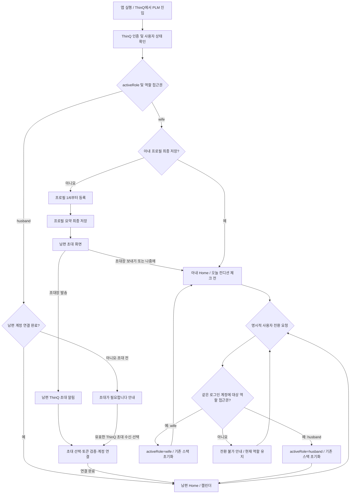

# 사용자 역할 흐름 V2

작성일: 2026-09-17  
기준: `docs/requirements/renew/` 전체, 지정된 아내·남편 화면설계서와 DB 스키마 PDF, `SCREEN_CHANGE_IMPACT_V2.md`. 경로와 guard의 상세 계약은 [ROUTE_MAP_V2.md](ROUTE_MAP_V2.md)를 따른다.

## 앱 진입·연결·역할 전환

`auth`는 현재 ThinQ 로그인 계정, `activeRole`은 표시 역할(`wife`/`husband`)이다. 서로 같은 값으로 취급하지 않는다. 명시적 전환 성공 시에만 `activeRole`을 바꾸고 이전 역할의 navigation stack을 지운다. 전환 도착점은 아내 `/wife/home`, 남편 `/husband/calendar`다. 아내 프로필이 미완료라면 `/wife/profile/onboarding/1` 진입 규칙을 적용한다.

아내는 남편 **초대 전에도** 홈에 들어간다. 남편은 **연결 전** PLM 가입 화면 없이 초대 필요 안내만 본다. 초대 알림은 ThinQ 영역이고, 남편 PLM 알림 목록에는 들어가지 않는다. 초대 토큰 만료·재사용, 중복 연동, 서버 오류는 지정 유스케이스 UC16의 실패 안내와 재시도/재초대 요청으로 처리한다.

지정 자료에서 아내·남편은 각각 자신의 ThinQ 계정으로 사용한다. 같은 로그인 계정의 양쪽 역할 접근권과 앱 내 전환 버튼은 정의되지 않았다. 위 전환 분기는 요청된 라우팅 계약이며 **권한 근거와 UI는 확인 필요**다. 접근권이 없는 역할로 전환하거나 다른 역할 URL에 직접 들어와도 역할을 자동 변경하지 않고 현재 역할 홈으로 보낸다. 새로고침 시 계정에 묶인 `activeRole`을 복원하고 접근권을 다시 검증한다.
