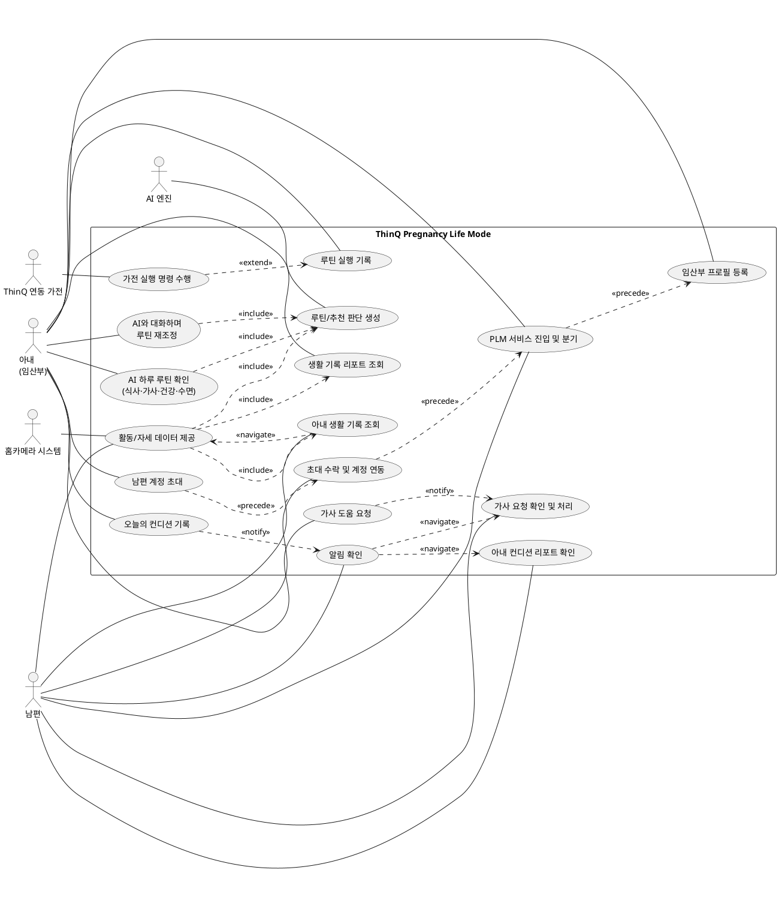

# 유스케이스 다이어그램: ThinQ Pregnancy Life Mode

- 작성 기반: `1차문서.pdf`(CX 리서치 보고서), `PRD.md`, `MVP.md`
- 목적: 시스템과 사용자/외부 시스템 간 상호작용을 한눈에 보여주는 최상위 유스케이스 구조 정의 (세부 입력 동작·화면 단위 기능은 제외)

---

## 1. 액터 정의

| 액터 | 구분 | 설명 |
|---|---|---|
| 아내 (임산부) | 내부 액터 (Primary) | 임신 정보와 컨디션을 입력하고, 개인화된 루틴을 확인·조정·실행하는 주 사용자 |
| 남편 | 내부 액터 (Secondary) | 아내가 공유한 정보를 확인하고 집안일·가전 실행 등 케어 행동을 분담하는 보조 사용자 |
| **AI 엔진** | 외부 액터 | 프로필·컨디션·임신 주차·전일 활동 데이터를 입력받아 **루틴 생성, 메뉴 추천, 챗봇 응답 등 서비스의 모든 개인화 판단을 수행**하는 핵심 시스템. LLM 기반 외부 API 또는 별도 백엔드 엔진으로 연동 |
| ThinQ 연동 가전 | 외부 액터 | 로봇청소기, 세탁기·건조기, 식기세척기, 공기청정기, 냉난방기 등 AI 엔진의 판단에 따른 실행 명령을 수신해 동작하는 외부 스마트홈 시스템 |
| 홈카메라 시스템 | 외부 액터 | 자세·활동 패턴을 감지해 모션 데이터를 AI 엔진에 제공하는 외부 센서 시스템 (의료 진단 기능 아님) |

총 5개 액터(내부 2 + 외부 3)로 구성됩니다. **서비스의 모든 판단 주체는 AI 엔진이며**, 아내/남편용 화면은 AI 엔진의 판단 결과를 사용자에게 보여주고 사용자 입력·행동을 다시 AI 엔진에 전달하는 역할을 합니다.

---

## 2. 액터별 주요 유스케이스

### 아내 (임산부)
- PLM 서비스 진입 및 분기
- 임산부 프로필 등록
- 남편 계정 초대
- 오늘의 컨디션 기록
- AI 하루 루틴 확인 (식사·가사·건강·수면)
- AI와 대화하며 루틴 재조정
- 가사 도움 요청
- 루틴 실행 기록
- 생활 기록 리포트 조회

> **상위 유스케이스에 흡수한 세부 동작** — 아래 세 가지는 화면 단위 동작이므로 별도 유스케이스로 두지 않고 상위 유스케이스에 포함한다.
> - **오늘 예정 활동(집안일) 선택** → **UC3**에 포함. 컨디션 기록(UC2) 완료 후 루틴 생성을 호출하기 전에 거치는 순차 단계다
> - **가사 요청 상태 조회**(남편의 확인/완료 상태를 아내가 확인) → **UC5**에 포함. 별도 알림 없이 아내가 요청 화면에서 조회하는 구조이므로 독립 유스케이스로 분리하지 않는다
> - **당일 홈캠 로그 조회**(아내가 실시간 탭에서 확인) → **UC13**에 포함. 아내·남편이 동일 로그를 공유 조회하므로 UC13 하나로 관리한다

### 남편
- PLM 서비스 진입 및 분기
- 초대 수락 및 계정 연동
- 알림 확인
- 아내 컨디션 리포트 확인
- 가사 요청 확인 및 처리
- 아내 생활 기록 조회
- 위험 행동 로그 조회 (아내와 공유, 캘린더 화면을 통해 진입)

### AI 엔진 (외부 시스템)
- 루틴/추천 판단 생성

### ThinQ 연동 가전 (외부 시스템)
- 가전 실행 명령 수행

### 홈카메라 시스템 (외부 시스템)
- 활동/자세 데이터 제공

---

## 3. PlantUML 코드

---

## 4. 관계 정의

다이어그램의 관계선을 읽는 기준이다.

| 관계 | 의미 |
|---|---|
| `UC5 ..> UC9 : <<notify>>` | 아내가 가사 요청을 전송하면 남편에게 알림이 생성되고 처리 유스케이스로 이어진다 |
| `UC12 ..> UC6 : <<extend>>` | **가전 실행은 루틴 실행 기록의 필수 구성요소가 아니다.** 가전 자동 실행은 Phase 2 범위이므로, 연결 가전이 있고 실행이 이루어진 경우에만 실행 결과가 루틴 기록을 확장한다. 가전 연동이 없어도 직접 행동·남편 요청만으로 UC6은 온전히 성립한다 |
| `UC13 ..> UC11 : <<include>>` | 홈캠 감지 데이터는 익일 AI 루틴 판단의 입력으로 전달된다 (당일 즉시 루틴 변경 없음) |
| `UC13 ..> UC7 : <<include>>` | 홈캠 감지 데이터는 백엔드 저장을 거쳐 **해당 날짜 Daily Report의 주의사항**으로도 이어진다. 오늘 이전의 감지 내용은 실시간 화면이 아니라 이 경로(캘린더 → 날짜 → Daily Report)로 조회한다 |
| `UC13 ..> UC10 : <<include>>` | 남편이 조회하는 날짜별 생활 기록에도 동일한 홈캠 주의사항이 포함된다 |
| `UC2 ..> UC14 : <<notify>>` | 아내가 오늘의 컨디션 또는 예정 활동을 수정해 루틴이 다시 생성되면 남편에게 **루틴 변경 알림**("아내의 루틴이 변경되었습니다.")이 생성된다. 남편이 알림 배너를 선택하면 캘린더의 변경된 루틴 요약으로 이동하고, 변경 항목은 배너 색상으로 구분된다 |
| `UC14 ..> UC8 / UC9 : <<navigate>>` | 알림 목록에서 항목을 선택하면 해당 상세 화면으로 이동한다. 알림은 **오전 컨디션 리포트 도착·가사 요청 도착·루틴 변경 3종뿐**이며, 가사 요청의 상태 변화(확인/미완료 등)로는 알림을 생성하지 않는다. **남편 초대 알림은 ThinQ 서비스 내 알림이므로 이 목록에 포함하지 않는다** |
| `UC10 ..> UC13 : <<navigate>>` | **남편의 실시간 로그 진입 경로.** 남편 앱에는 하단 메뉴바가 없어 '실시간' 탭이 존재하지 않는다. 남편은 캘린더(UC10) 화면의 '실시간 홈캠 신체 정보 보기' 버튼으로만 UC13에 진입한다. 아내는 하단 메뉴바의 '실시간' 탭으로 직접 진입한다. **진입 경로만 다르고 조회하는 로그는 동일**하다 |
| `UC15 ..> UC16 : <<precede>>` | 아내의 초대 발송(ThinQ 알림 발송 요청)이 남편의 초대 수락·계정 연동에 선행한다 |
| `UC16 ..> UC17 : <<precede>>` | **남편의 최초 진입은 ThinQ 앱에 도착한 초대 알림을 선택해 연동(UC16)하는 경로로만 이루어진다.** 연동이 완료된 이후부터 남편은 ThinQ에서 Pregnancy Life Mode를 선택해 진입(UC17)할 수 있고, 진입 시 캘린더 화면(남편 홈)으로 이동한다 |
| `UC17 ..> UC1 : <<precede>>` | 아내가 프로필 미등록 상태로 진입하면 프로필 등록 온보딩으로 라우팅된다 |

### UC17의 분기 범위

UC17은 아내와 남편 모두의 진입 지점이지만, **분기 조건은 역할별로 다르다.**

- **아내**: 임산부 프로필 등록 여부로 분기한다. 미등록이면 프로필 등록(UC1), 등록 완료면 홈(UC3)으로 이동한다
- **남편**: 진입 분기 자체가 계정 연동 이후에만 의미를 갖는다. 남편은 **ThinQ 앱에 도착한 초대 알림을 선택해 연동(UC16)**하는 경로로만 서비스에 들어오며, **연동을 마친 뒤 ThinQ에서 모드를 선택하면 캘린더 화면(남편 홈)으로 진입**한다. 연동 전 상태에서는 초대가 필요하다는 안내만 표시하고 별도 가입 절차로 진행하지 않는다
