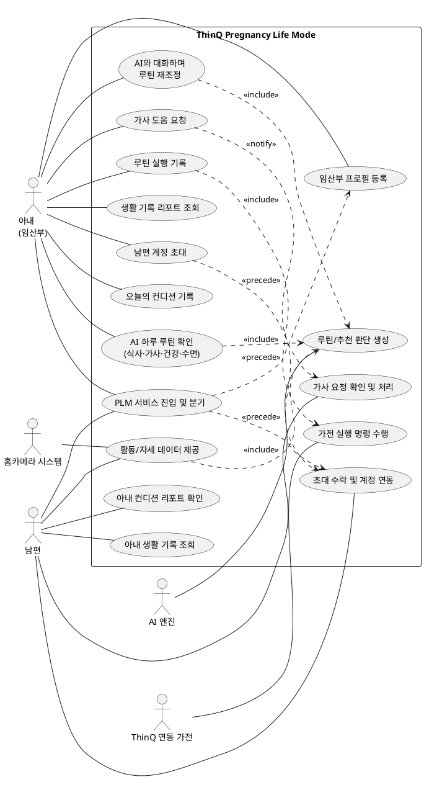

# 유스케이스 다이어그램: ThinQ Pregnancy Life Mode

- 작성 기반: `1차문서.pdf`(CX 리서치 보고서), `PRD.md`, `MVP.md`
- 목적: 시스템과 사용자/외부 시스템 간 상호작용을 한눈에 보여주는 최상위 유스케이스 구조 정의 (세부 입력 동작·화면 단위 기능은 제외)

---

## 1. 액터 정의

| 액터 | 구분 | 설명 |
|---|---|---|
| 아내 (임산부) | 내부 액터 (Primary) | 임신 정보와 컨디션을 입력하고, 개인화된 루틴을 확인·조정·실행하는 주 사용자 |
| 남편 | 내부 액터 (Secondary) | 아내가 공유한 정보를 확인하고 집안일·가전 실행 등 케어 행동을 분담하는 보조 사용자 |
| **AI 엔진** | 외부 액터 | 프로필·컨디션·임신 주차·전일 활동 데이터를 입력받아 **루틴 생성, 메뉴 추천, 챗봇 응답 등 서비스의 모든 개인화 판단을 수행**하는 핵심 시스템. LLM 기반 외부 API 또는 별도 백엔드 엔진으로 연동 |
| ThinQ 연동 가전 | 외부 액터 | 로봇청소기, 세탁기·건조기, 식기세척기, 공기청정기, 냉난방기 등 AI 엔진의 판단에 따른 실행 명령을 수신해 동작하는 외부 스마트홈 시스템 |
| 홈카메라 시스템 | 외부 액터 | 자세·활동 패턴을 감지해 모션 데이터를 AI 엔진에 제공하는 외부 센서 시스템 (의료 진단 기능 아님) |

총 5개 액터(내부 2 + 외부 3)로 구성됩니다. **서비스의 모든 판단 주체는 AI 엔진이며**, 아내/남편용 화면은 AI 엔진의 판단 결과를 사용자에게 보여주고 사용자 입력·행동을 다시 AI 엔진에 전달하는 역할을 합니다.

---

## 2. 액터별 주요 유스케이스

### 아내 (임산부)
- PLM 서비스 진입 및 분기
- 임산부 프로필 등록
- 남편 계정 초대
- 오늘의 컨디션 기록
- AI 하루 루틴 확인 (식사·가사·건강·수면)
- AI와 대화하며 루틴 재조정
- 가사 도움 요청
- 루틴 실행 기록
- 생활 기록 리포트 조회

### 남편
- PLM 서비스 진입 및 분기
- 초대 수락 및 계정 연동
- 프로필 조회
- 아내 컨디션 리포트 확인
- 가사 요청 확인 및 처리
- 아내 생활 기록 조회
- 위험 행동 로그 조회 (아내와 공유)

### AI 엔진 (외부 시스템)
- 루틴/추천 판단 생성

### ThinQ 연동 가전 (외부 시스템)
- 가전 실행 명령 수행

### 홈카메라 시스템 (외부 시스템)
- 활동/자세 데이터 제공

---

## 3. PlantUML 코드

